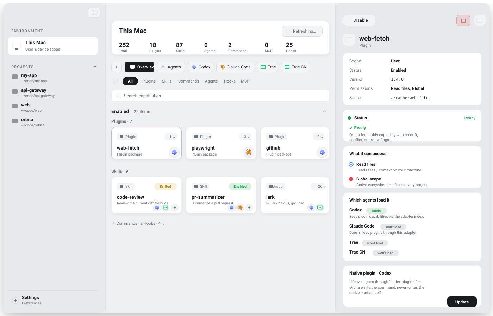

<div align="center">
  <a href="https://github.com/LLLLLayer/orbita/releases/latest">
    
  </a>
  <h1>Orbita</h1>
  <p><strong>看清你 Mac 上每个 Coding Agent 实际加载了什么 —— 以及哪些漂移、冲突或带有风险。</strong></p>
  <p>一个本地的 macOS 控制台与 CLI，把 Codex Desktop、Claude Code、插件缓存以及跨 Agent 的 <code>.agents</code> 工作区，统一成一个事实来源。<strong>它不是插件商店。</strong></p>

  <p>
    <a href="https://github.com/LLLLLayer/orbita/releases/latest"><strong>下载 macOS 版</strong></a> ·
    <a href="#quickstart">快速上手</a> ·
    <a href="#what-it-does">能做什么</a> ·
    <a href="#cli--same-engine-scriptable">CLI</a> ·
    <a href="docs/capability-lifecycle.md">文档</a>
  </p>

  <p>
    <a href="https://github.com/LLLLLayer/orbita/releases/latest"></a>
    <a href="LICENSE"></a>
    
  </p>

  <p>
    <a href="README.md">English</a> ·
    简体中文 ·
    <a href="README.zh-TW.md">繁體中文</a>
  </p>

  
  <br/><sub>浅色/深色随 GitHub 主题自适应 · 为布局示意图，非实机截图</sub>
</div>

---

你同时在用 Codex Desktop 和 Claude Code。同一个 Skill 在一个 Agent 里启用、在另一个里
却看不见，某个插件路径悄悄失效，而项目里的 `.agents` 意图也早已和磁盘上的实际情况对不上 ——
却没有任何东西提醒你。

**Orbita 是一个本地事实来源，告诉你每个 Agent 实际加载了什么。** 它扫描你的本机和仓库，把每个
Agent 的原生配置、插件缓存以及跨 Agent 的 `.agents` 层统一成一个视图，展示**每项能力从哪里来、
哪个 Agent 能看到它、以及它有没有漂移、冲突或带有风险。**

它**不是**插件商店，也从不接管你的配置：生命周期变更都通过各 Agent 自己的工具
（`codex` / `claude` / `npx skills`）完成，原生客户端始终是事实来源。整个仓库由一个 SwiftPM
包同时产出三件事 —— **OrbitaCore**（全部 scan / resolve / apply 语义）、**`orbita` CLI**
（正统产品面），以及 **OrbitaApp**（复用同一引擎的 SwiftUI 可视化层，内置 Sparkle 自动更新）。

## Download & install

每次发布都会由标签驱动的 GitHub Release 工作流产出已签名、已公证的 DMG。

- **最新版本：** [github.com/LLLLLayer/orbita/releases/latest](https://github.com/LLLLLayer/orbita/releases/latest)
- **全部版本：** [github.com/LLLLLayer/orbita/releases](https://github.com/LLLLLayer/orbita/releases)
- App 通过 [Sparkle](https://sparkle-project.org) 自动原地更新。
- 系统要求：**macOS 15 或更新版本。**

Orbita 需要读取你的主目录和项目来发现能力，因此首次扫描时 macOS 可能会请求**完全磁盘访问权限**
（Full Disk Access）—— 除下文那条很窄的[写入边界](#risk--trust)外，所有访问都是本地、只读的。
更喜欢命令行？直接看 [CLI](#cli--same-engine-scriptable)。

## Quickstart

**在 App 里**

1. **打开 Orbita**，选择一个项目目录（或从侧边栏打开已有项目）。
2. Orbita 会**扫描**你的本机和该项目，构建一张统一的能力图谱。
3. 切换 **Agents · Codex · Claude Code** 这几个标签，看每个 Agent 实际加载了什么，
   再点开任意一项能力，查看它的 source、scope、status、access/risk 标记和 skills-lock 元数据。

**用 CLI** —— 同一次扫描，一条命令：

```bash
swift run orbita overview --project-root <path>
```

## What it does

- 🗺️ **统一能力图谱** —— 在用户级、项目级、原生 Agent 配置、插件缓存和 `.agents` intent 之间做一次统一扫描。
- 👁️ **Agent 视角** —— 精确看到 Codex、Claude Code 各自加载了什么、又有什么被隐藏。
- 🌊 **漂移与冲突诊断** —— broken path、duplicate、shadowed、已禁用但仍被发现、review flag，逐项给出解释。
- ⚠️ **风险可见性** —— 标记读文件、写文件、执行命令、网络访问、secrets 和全局作用域等风险。
- 🔁 **安全的生命周期** —— 可干跑的 `merge` / `enable` / `disable` / `delete` / `clean` / `rollback`，并能触发原生插件更新。
- 🍴 **Agent sync（fork）** —— 把一个 Skill / command / agent 以 copy 或 symlink 方式装进另一个 Agent 的目录，作为一次 lock-less、由 Orbita 托管的安装。
- 📦 **兼容 Skills CLI** —— 读取 `skills-lock.json` / `.skill-lock.json`，展示 source / ref / hash / skillPath、canonical 路径以及推断出的安装目标。
- ⌨️ **与 CLI 同一套引擎** —— 每个视图都由 `OrbitaCore` 驱动；`orbita` CLI 走的是同样的代码路径，并支持 `--json` 输出。

Orbita 为每个 Agent 读取的来源：

| Agent | Orbita 读取的来源 |
|-------|--------------------|
| **`.agents`**（跨 Agent） | `manifest.json` intent、生成的 adapter preview、lock 数据 |
| **Codex Desktop** | 插件缓存、`~/.codex/config.toml`、项目 `.codex/` commands 与 hooks、MCP 配置 |
| **Claude Code** | `~/.claude/…` + `installed_plugins.json`、项目 `.claude/` commands、`settings.json` hooks、instructions |
| **虚拟 Plugin** | 从 package 内容、本地目录和插件缓存中推断 |

## How intent works: Source · Intent · Visibility

Orbita 严格区分三个层 —— 把它们混在一起，正是多 Agent 配置让人困惑的根源。

| 层 | 存放位置 | 它是什么 | 这里“disable”意味着 |
|----|----------|----------|----------------------|
| **Source** | 真实文件 / 插件缓存 / package | 能力在磁盘上的物理存在 | 什么都不变 —— 文件仍在磁盘上 |
| **Intent** | `.agents/manifest.json` | 你的跨 Agent 启停意图 | 通过 intent 把能力隐藏；**源文件原地不动** |
| **Visibility** | 每个 Agent 的视图 | 某个 Agent 实际加载了什么 | 该能力不再出现在这个 Agent 里 |

当 intent 标记为“disabled”、而源文件在磁盘上仍可被扫描到时，这种不一致**就是漂移（drift）**
—— Orbita 的 drift report 会准确解释原因。

## Risk & trust

- **只在本地。** Orbita 读取你的本机和仓库来构建图谱，不会回传任何数据。
- **原生客户端始终是事实来源。** Codex 的启用状态存在 `~/.codex/config.toml` + 插件缓存里，Claude 存在 `~/.claude/settings.json` + `installed_plugins.json` 里。Orbita 通过 `codex` / `claude` / `npx skills` 去驱动它们，而不是在背后偷改。
- **一条很窄的写入边界。** 带 `--apply` 时，Orbita 只会写入项目的 `.agents/` 和 `.orbita/`，**外加** —— 仅限 agent-sync（fork）—— 目标 Agent 自己的 skills / commands / agents 目录。其余一切都以 shell 命令的形式输出，交给你（或原生 CLI）执行。
- **风险标记。** 能力会被标记读文件、写文件、执行命令、网络访问、secrets 和全局作用域，让你在启用前就能看清它能触达什么。

## Lifecycle & Apply Plan

每一次变更都是**一份可以先干跑的、带类型的计划（plan）**。计划会列出每个操作的 path、target、
risk 和说明 —— 在任何东西落盘之前，你就能看清究竟会发生什么。

- **动作：** `merge`、`enable`、`disable`、`delete`、`clean`、`rollback`，以及 **agent-sync（fork）**。
- **干跑 vs 应用：** `plan` 不带 `--apply` 是干跑；带 `--apply` 后会执行并返回 completed / failed / pending 操作集。
- **Hook：** 一份 Claude `settings.json` / `hooks.json` 会注册很多 handler，Orbita 对每个 handler 单独建模；由于 Claude 没有按单个 hook 禁用的能力，单个 hook 唯一的动作是 delete。

各 Agent 的 enable / disable / update / delete 权威规范见
[docs/capability-lifecycle.md](docs/capability-lifecycle.md)。

## CLI — same engine, scriptable

App 只是 `OrbitaCore` 的可视化层；`orbita` CLI 走的是同样的代码路径，也是正统的产品面。给任意命令
加上 `--json` 即可得到机器可读输出。

```bash
swift run orbita help                                       # 或 --help / -h / 无参数
swift run orbita scan     --project-root <path> [--json]
swift run orbita status   --project-root <path> [--json]
swift run orbita graph    --project-root <path> [--json]
swift run orbita overview --project-root <path> [--json]
swift run orbita drift    --project-root <path> [--json]
swift run orbita agent    --project-root <path> --agent codex|claude-code [--json]
swift run orbita explain  --project-root <path> <capability-id> [--json]
swift run orbita preview  --project-root <path> --agent <id> [--json]
swift run orbita doctor   [--project-root <path>] [--json]
swift run orbita plan     --project-root <path> --merge|--rollback|--clean|--enable <id>|--disable <id>|--delete <id> [--apply] [--json]
swift run orbita plan     --project-root <path> --sync <id> --agent <id> [--mode copy|symlink] [--scope project|user] [--apply] [--json]
```

`plan --sync` 会把一个 Skill / command / agent 以 copy（或默认的 symlink）方式装进目标 Agent
的目录，作为一次 lock-less、由 Orbita 托管的安装。

<details>
<summary>参数与约定</summary>

- `--no-user-scope` 只扫描项目作用域。
- `--project-root <path>` 与 `--project <path>` 是同义写法，路径也可以作为位置参数直接传。
- `plan` 不带 `--apply` 是干跑；带 `--apply` 后返回 completed / failed / pending 操作集。
- `--json` 返回结构化输出（错误以结构化的 `CLIErrorPayload` / `CLIApplyExecutionErrorPayload` 给出）。

</details>

<details>
<summary><strong>它是怎么工作的（架构）</strong></summary>

整条流水线是单向的，全部位于 `Sources/OrbitaCore/`：

```text
Scan ──▶ Resolve ──▶ Project layers ──────────────▶ Apply
 │          │              │                          │
 │          │              │   ApplyPlanBuilder builds a typed plan;
 │          │              │   ApplyPlanExecutor is the only disk mutator
 │          │              │
 │          │              └─ AgentView · Overview · AdapterPreview · Drift · Doctor · Explain
 │          │
 │          └─ CapabilityResolver → CapabilityGraph (marks duplicate / shadowed / drifted)
 │
 └─ CapabilityScanner → raw Capability records + ScanIssues
```

整个仓库由一个 SwiftPM 包同时产出三件事：

- **OrbitaCore** —— scan / resolve / agent-view / overview / adapter-preview / drift / doctor / apply-plan 的全部语义都在这里。
- **`orbita` CLI** —— 调用 `OrbitaCore`、输出文本或 `--json` 的轻量包装。
- **OrbitaApp** —— 复用同一份 Core 的 SwiftUI macOS App，内置 Sparkle 自动更新与 Textual Markdown 渲染。

正式支持的 Agent 是 `codex` 和 `claude-code`。完整的生命周期契约见
[docs/capability-lifecycle.md](docs/capability-lifecycle.md)；Hook 模型见
[docs/hook-logic.md](docs/hook-logic.md)。

</details>

<details>
<summary><strong>构建与贡献</strong></summary>

```bash
swift build                       # SwiftPM build of all targets
swift test                        # OrbitaCoreTests + OrbitaCLITests
swift test --filter <name>        # single test
./script/xcode_build.sh build     # xcodebuild against Orbita.xcodeproj (scheme: Orbita)
./script/build_and_run.sh         # build + open Orbita.app
./script/build_and_run.sh --verify     # build + open + assert process is running
./script/build_and_run.sh --telemetry  # stream OSLog subsystem dev.orbita.app
swift run orbita <command>        # run the CLI from source
```

- **Xcode：** `open Orbita.xcodeproj`，选择 **`Orbita`** scheme（仓库里也有一个 `Orbita.xcworkspace`）。
- **遥测：** `--telemetry` 会跟随 `dev.orbita.app` 的 OSLog subsystem（`App`、`Scan`、`Apply` category）。扫描日志（`scan.start`、`scan.phase`、`scan.finish`、`scan.failed`）附带能力数、issue 数和耗时。
- **新增 / 修改某个 Agent 的发现规则**在 `Sources/OrbitaCore/CapabilityScanner.swift`；大多数行为变更都需要在 `Tests/OrbitaCoreTests/Fixtures/` 下加一个 fixture，并在 `CapabilityScannerTests.swift` 里补断言。

```text
Sources/
  OrbitaCore/   扫描、解析、图谱模型、Apply Plan、状态报告
  OrbitaCLI/    scan/status/overview/plan/doctor 等命令行入口
  OrbitaApp/    SwiftUI macOS App 和能力控制台
Support/        App bundle metadata、entitlements、发版配置
Tests/          Scanner、Resolver、Apply Plan、CLI 和 fixture
docs/           公开文档、生命周期规范、发版清单
script/         本地构建、运行、打包、签名和发版脚本
```

</details>

## 文档

- [docs/capability-lifecycle.md](docs/capability-lifecycle.md) —— 各 Agent enable / disable / update / delete 的权威规范。
- [docs/hook-logic.md](docs/hook-logic.md) —— Hook 扫描契约（event / matcher / handler 模型与 host 推断）。
- [docs/release.md](docs/release.md) —— 签名、notarization、DMG、Sparkle appcast 清单。

<details>
<summary>FAQ</summary>

- **首次打开被 macOS 拦截。** App 经由发布工作流签名并公证；若 Gatekeeper 仍然告警，右键点击 App → **打开**。
- **扫描结果为空。** 把 Orbita 指向一个含有 `.agents/`、`.codex/`、`.claude/` 或 `.mcp.json` 的项目，并授予完全磁盘访问权限，以便看到用户级来源。
- **`--apply` 会写到哪里？** 只写项目的 `.agents/` 和 `.orbita/`，外加 agent-sync 的目标目录。其余一切都以命令形式输出，交给你执行。

</details>

## 许可证

Orbita 以 [MIT License](LICENSE) 发布。

## 开源致谢

Orbita 站在开源社区的肩膀上，特别依赖以下项目：

- [**Sparkle**](https://github.com/sparkle-project/Sparkle) —— macOS App 的软件更新框架。MIT License。
- [**Textual**](https://github.com/gonzalezreal/textual) —— SwiftUI 的 Markdown 渲染。MIT License。

同时也从 Codex Desktop、Claude Code 以及更广义的 Coding Agent 生态中汲取灵感
—— Orbita 读取的能力格式都来自这些工具。
