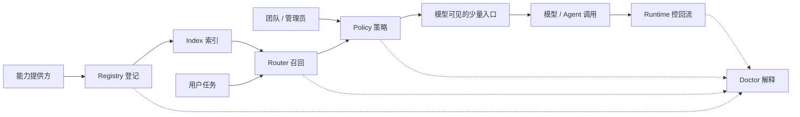

# 别让 Agent 淹死在技能池里

> **核心观点**：能力越多，不等于 Agent 越强。能力一多，模型反而更容易选错工具、上下文更容易被噪声撑爆。该治理的不是“能力数量”，而是“默认让模型看见多少”——而且不同痛点对应不同手段，不必全做。
>
> 赶时间的话，直接看**第三节**（怎么按痛点选）和**第七节**（每个手段什么时候值得做）。

## 一、哪些东西会进入上下文

**上下文并由启动注入、按需触发、工具返回、资源引用、子任务回流和历史累积共同构成，并会受到压缩、清理和限额策略影响：**

| 能力类型 | 默认暴露 | 触发后暴露 |
| --- | --- | --- |
| **Skills** | `name / description` | `SKILL.md`、references、脚本输出 |
| **MCP Tools** | tool name 或 schema | tool schema、tool result |
| **MCP Resources** | URI / 资源索引 | resource content |
| **Subagents** | 可委派能力 | 子任务结果回流 |
| **Hooks** | 默认不可见 | `additionalContext` |

1. 系统 / 开发者 / 项目级指令通常会作为启动级或请求级的高优先级上下文注入；在 Claude Code 中，项目级 CLAUDE.md、rules 等会按其加载策略进入上下文，其中部分稳定上下文会在 compaction 后重新注入；
2. Skills 默认会在 skill listing 中暴露 name、description，以及 Claude Code 当前支持的 when_to_use 合并文本；当 Skill 被触发后，完整 SKILL.md 会进入会话，references / examples 按需读取，脚本按需执行，其输出也可能进入上下文；
3. MCP Server 可以暴露 tools、resources 和 prompts；tool schema 的加载方式由客户端决定。Claude Code 默认通过 Tool Search 延迟加载相关 tool schema；tool result 会在调用后反馈进后续上下文；resource content 则通常在被引用或读取后才进入上下文；
4. Subagent 默认创建独立的子上下文运行；任务完成后，结果会回流到主会话。最佳实践是让 Subagent 返回摘要或结构化结论，但如果返回详细结果，仍会占用主上下文；
5. Hooks 默认作为外部生命周期脚本执行，本身不直接进入模型上下文；只有当 Hook 返回 additionalContext 时，对应内容才会被注入上下文；
6. 文件读取、网页 / 代码搜索、图片或 PDF 解析、命令输出以及历史工具结果，通常会随着会话推进持续累积进入上下文；但在 compaction、tool result clearing、手动清理或上下文溢出策略下，旧内容可能被摘要、截断或移除。

> [Claude Code Features Overview](https://code.claude.com/docs/en/features-overview) 官方汇总 CLAUDE.md、Skills、MCP、Subagents、Hooks 的加载方式。

---

## 二、能力规模化带来的上下文失控

不同能力进入上下文的路径不同，执行边界不同，结果回流的方式也不同，因此风险面也不一样：

| 能力类型 | 进入上下文的方式 | 主要风险 |
| --- | --- | --- |
| **Skills** | 默认暴露 name / description / when_to_use 等 listing 信息；命中后加载完整 SKILL.md，并按需读取 references、执行 scripts | description 过长导致预算截断；多个 Skill 语义重叠导致误触发；命中后的正文和脚本输出污染会话上下文 |
| **MCP Tools** | Server 暴露 tool definition / schema；客户端决定 upfront 或 deferred 加载；调用后 tool result 回流上下文 | tool / schema 数量膨胀；相似工具难以消歧；调用结果过大、低信号或被外部内容污染 |
| **MCP Resources** | 通常以 URI 或资源索引形式可发现；被引用或读取后，resource content 才进入上下文 | 文件或网页内容过大；来源不可信；外部内容携带 prompt injection |
| **Hooks** | Hook 本身作为外部生命周期脚本运行，默认不进入模型上下文；只有返回 additionalContext 时才注入 | 脚本副作用、权限过大、审计不足；返回内容夹带不可信信息 |
| **Subagents** | 主会话只看到可委派能力；spawn 后创建独立子上下文；完成后结果回流主会话 | 误以为天然省上下文；子上下文可能被预加载 Skills / tools 撑大；详细结果回流污染主上下文 |

单个能力看起来只是一个 Skill、一个 Tool 或一个 Hook，但当它们被统一接入 Agent 后，会叠加成系统级风险：

| Agent 风险层 | 典型来源 | 具体表现 |
| --- | --- | --- |
| **路由风险** | Skill description、MCP tool schema、Subagent description | 能力太多、描述重叠、触发词缺失，导致模型选错、漏选或摇摆 |
| **上下文污染风险** | Skill body、tool result、resource content、hook additionalContext | 大段正文、日志、网页、文件或工具结果回流后，稀释主任务上下文 |
| **执行副作用风险** | MCP Tools、Hooks、Subagents | 发消息、改文件、调用 API、执行脚本等动作可能超出预期 |
| **权限扩散风险** | tool allowlist、filesystem、network、credentials | Agent 能访问的外部系统越多，误用和越权风险越高 |
| **历史累积风险** | 文件读取、代码搜索、网页结果、历史工具输出 | 会话越长，旧信息越多，后续判断越容易被噪声影响 |
| **隔离失效风险** | Subagents、fork context、结果回流 | 子任务虽然在独立上下文中执行，但详细结果仍可能回流污染主会话 |

---

## 三、从“全量暴露”走向“控制面治理”

能力可以很多，但**默认进入模型视野的必须少**。不管叫 Tool Search、Registry 还是 Pack，这些手段都在回答同一件事：这次任务，让模型看见哪些能力、看见多少。

手段虽多，其实只在解两个痛点，外加一条横切的安全问题：

- **路由失灵**——能力一多，模型选错、漏选、来回摇摆。根因是候选太多、描述太像。
- **上下文超载**——命中之后，正文、工具结果、网页、历史不断回流，把主任务挤没了。根因是“进来的内容没有预算”。
- **执行失控**（横切）——能力会发消息、改文件、部署。这是安全问题，不按 token 算，但同样靠控制可见性加分级（发现时过滤、调用时校验）来治。

几乎每个流行手段，都对应这三类痛点之一。下面这张手段地图，每个手段配一个代表方案；它们各自的来龙去脉，文末参考资料里展开：

| 痛点 | 手段 | 做什么 | 代表方案 |
| --- | --- | --- | --- |
| **路由失灵** | 精简描述 | 把描述当路由接口写，而不是文案 | [Writing Effective Tools](https://www.anthropic.com/engineering/writing-tools-for-agents) |
| | 按需加载 | 默认只露搜索入口，命中再加载定义 | [Claude Tool Search](https://code.claude.com/docs/en/mcp) · [OpenAI defer_loading](https://openai.github.io/openai-agents-python/tools/#tool-search) |
| | 检索路由 | 系统先召回 top-K，模型不读长列表 | [LangGraph BigTool](https://github.com/langchain-ai/langgraph-bigtool) · [SkillRouter](https://arxiv.org/abs/2603.22455) |
| | 按场景打包 | 按场景给模型一组筛过的入口 | [Claude Plugins](https://code.claude.com/docs/en/plugins) · [OpenAI namespace](https://openai.github.io/openai-agents-js/guides/tools/) |
| **上下文超载** | 结果预算 | 分页 / 摘要 / 字段白名单，控制回流 | [Context Engineering](https://www.anthropic.com/engineering/effective-context-engineering-for-ai-agents/) |
| | 隔离（子 agent / fork） | 高噪声任务挪出去，只回摘要 | [Claude Subagents](https://code.claude.com/docs/en/sub-agents) · [Code Execution with MCP](https://www.anthropic.com/engineering/code-execution-with-mcp) |
| **执行失控** | 分级触发 | 高危能力默认手动 / 确认 | [disable-model-invocation](https://code.claude.com/docs/en/skills) |
| | 权限前置 | 越权能力根本不进模型视野 | [Prompts Don't Protect](https://arxiv.org/abs/2605.18414) |
| | 供应链审计 | 来源校验、锁版本、可回滚 | [Snyk ToxicSkills](https://snyk.io/blog/toxicskills-malicious-ai-agent-skills-clawhub/) · [Sigstore](https://www.sigstore.dev/) |

**不必全做。** 按投入和能力规模，大致分三档，多数团队停在前两档：

- **止血**（几十个能力）：调预算、把明显没用的关掉。几分钟，治标。
- **收敛**（几十到几百）：精简描述、按场景打包、按路径或优先级收窄可见性。多数团队的主战场。
- **治理**（几百个，或多人多项目，或有高危能力）：检索路由、分级拦截、结果预算、审计评测。规模或风险到了才值得。

每个手段什么时候值得、什么时候是过度设计，见第七节。能力一旦跨人、跨项目复用，零散调每个开关就不够了，需要一层统一的**能力控制面**——下一节给出它的参考架构。

## 四、参考架构：控制面治理

要治理的不只是 Skill，而是 Capability——Agent 能用的一切：Skill、Plugin、MCP Server、子 agent、Hook、Rule、Workflow。把前面的判断收成一个理想形态：不管底层接哪家 agent，治理都能收敛到一层**能力控制面**。它不替模型干活，只管一件事——这次任务，模型能看见什么、能做什么。

理想形态里有四个角色，各管一段，互不越界：

- **能力提供方**——写清每个能力的描述、触发条件、风险和结果预算。源头的质量，决定了后面路由和拦截好不好做。
- **团队 / 管理员**——按场景把能力打包，设默认可见性和风险分级，划出安全底线。
- **用户**——按手头任务挑场景、确认高危动作，而不是直面几百个零散能力。
- **模型 / Agent**——只在筛过的少量入口里工作，调用并拿到受控的结果。

控制面是连接这四个角色的中间层，内部由五个组件组成：

| 组件 | 理想职责 |
| --- | --- |
| **Registry 登记** | 把所有能力登记到一处——来源、版本、风险、触发条件、描述质量都在册。它是其余一切的事实底座。 |
| **Router 路由** | 任务开始前，从全量能力里召回与当前任务相关的一小撮，而不是把整张清单塞给模型。 |
| **Policy 策略** | 决定每个能力默认怎么暴露（常驻 / 按需 / 只留名 / 手动 / 关闭），高危的必须人来确认——不靠 prompt 约束。 |
| **Runtime 回流** | 能力执行后，控制结果怎么回到上下文：分页、摘要、隔离，只放决策需要的信息进来。 |
| **Doctor 解释** | 让整套可解释：为什么推荐这个、为什么没选那个、为什么被拦、哪些重复或过期或不可信。 |

> 一句话：Registry 负责登记，Router 负责选择，Policy 负责约束，Runtime 负责执行，Doctor 负责解释。

## 五、怎么起步

这套控制面是理想形态，不必一步到位。按第三节的止血 → 收敛 → 治理三档，从最便宜的做起：先盘一遍能力池，精简描述、关掉明显没用的（几分钟见效）；真到了几百个能力或多人协作，再上路由和策略。先让能力池可盘点、可收敛，控制面是水到渠成的事，不是前置工程。

## 六、最终判断

> ✅ Skill 爆炸后的解法不是继续堆 Skill，也不是指望模型在一个巨大列表里做选择。正确解法是：**能力登记在外部，项目配置做约束，任务开始前做推荐，用户确认做控制，高风险策略做拦截，Doctor 和评测做闭环。**

更短一点说：**我们要做的不是 Skill Finder，而是控制面治理。**

## 七、怎么选：对症下药，别全做

别把这些手段当 checklist 一项项上——大多数团队只用得到两三个。下面逐个说清：什么时候值得，什么时候是过度设计。

### 治“选错”

**精简描述，几乎所有人的第一步。** 描述是模型选工具的主要依据之一，改它见效最快、不碰架构。能力在几十到一两百、且靠模型自动触发时，这是性价比最高的一手。但它救不了几百个语义重叠的能力——描述再清楚也分不开一堆近义词，那是该上检索路由的信号。一个反直觉点：写清“什么时候**别**用”，往往比写“什么时候用”更能压住误触发。而对只由人触发的能力，更省事——根本不用给模型写描述，它压根不进模型上下文（Claude Code 的 `disable-model-invocation`），不占预算也不会误触发。

**按需加载（defer / Tool Search 等），工具多但不一定选错时用。** 它省的是工具定义白白占的 token，不解决选错——反而可能因为检索召回不全而漏选。MCP 工具几十上百、schema 很占地方时值得开；能力本来就少，多一跳检索延迟反而亏。

**检索路由（Registry + 检索），能力上百、来源杂、跨项目复用时才划算。** 把“让模型读长列表”换成“系统先召回 top-K”。它真正的价值不只是省 token，而是把候选筛选从模型注意力的黑箱，挪到一个可调、可评测的检索层（最终选哪个，仍由模型在召回集里定）。代价是工程成本——索引、向量、评测都得养；几十个能力时这套成本远大于收益，写好描述加分组就够。

**按场景打包（Pack / Namespace），能力多到人和模型都看不清边界时。** Pack 首先是给人看的入口设计：用户按“前端 / 数据 / 部署”这样的场景选一组，模型只看到这组里筛过的少量入口；namespace 顺带解决重名。能力本就不多、或场景边界模糊时硬分包，只会添乱。

### 治“撑爆”

**结果预算，工具会返回大块内容时的默认动作。** 日志、网页、查询结果原样回流，最容易把主任务挤没。默认就该分页、摘要、只留要用的字段，而不是整页糊回去。返回本来就小的工具，不用加。

**隔离（子 agent / fork），把长流程、高噪声任务挪到别处。** 但有个常见误解：开个子 agent 不等于省了主上下文——子任务要是把详细结果原样带回来，照样污染。只有强制“只回摘要 + 产物引用”时，隔离才真正省。

### 治“闯祸”（这块还早，可后置）

*只有当能力会发消息、部署、改文件，或来自第三方时才用得上——多数团队还没到这一步，可以先放一放。*

**分级触发。** 有真实副作用的能力（发消息、部署、删除、改文件）默认走手动或确认，别让模型自己点；纯查询不用加。光靠 prompt“禁止”越权不可靠——越权的能力干脆别进模型视野。

**供应链审计。** 装别人写的 Skill / MCP / 插件，等于引入外部代码，可能偷读密钥或埋诱导指令。生态普遍没签名，硬拦等于啥都装不了；务实做法是标清来源、锁版本、可回滚。全是自己写的能力，这步可省。

### 自动化之后：用评测兜底

**上了路由或分级，就绕不开评测和 Trace。** 没有评测，任何收紧都是盲调——你不知道这次是让模型更准了还是更笨了。Trace 要能说清：候选有谁、为什么推荐它、为什么没选那个、为什么被拦。可解释，是“治理”和“玄学调参”的分水岭。反过来，还在止血阶段就建评测，是给不存在的系统做回归。

### 三条容易踩反的直觉

- **描述写得漂亮 ≠ 路由变准。** 决定命中率的是触发边界，尤其“什么时候别用”，不是辞藻。
- **窗口大 ≠ 能随便塞。** 上下文越长、无关内容越多，有效利用越差（context rot）；能塞进去和能用对是两回事。
- **子 agent ≠ 省上下文。** 只有强制只回摘要、产物引用才省，默认不省。

## 参考资料

> 📌 第三节「手段地图」里的代表方案，这里按类别展开（有用点 + 出处）。每条资料首列的「关键词」标出它对应哪个业内做法，可按关键词横向扫到同主题的资料。阅读顺序：先看官方机制，再看工程实践，最后用论文和安全资料补证据。

### 1. 官方机制与规范

| 关键词 | 资料 | 有用点 | 支撑文档位置 |
| --- | --- | --- | --- |
| Tool Search | [Claude Code Features Overview](https://code.claude.com/docs/en/features-overview) | 官方汇总 CLAUDE.md、Skills、MCP、Subagents、Hooks 的加载方式；明确 Skill description 默认进入会话起点、MCP schema 可延迟。 | 第一部分：哪些能力会进入上下文。 |
| Tool Lint | [Claude Code Skills](https://code.claude.com/docs/en/skills) | Skill progressive disclosure、description budget、`paths`、`disable-model-invocation`、`context: fork`、manual-only。 | Skill 三重瓶颈、治理抓手。 |
| Tool Search | [Claude Code MCP](https://code.claude.com/docs/en/mcp) | MCP Tool Search、`ENABLE_TOOL_SEARCH`、`alwaysLoad`、工具输出限制；说明大量 MCP tools 不应全量塞进上下文。 | MCP 加载策略、Tool Search、结果回流。 |
| Tool Search | [OpenAI Agents SDK Tool Search](https://openai.github.io/openai-agents-python/tools/#tool-search) | `defer_loading`、`ToolSearchTool`、tool namespace：把工具定义从 upfront prompt 移到按需搜索。 | 行业对“大规模工具集”的共同解法。 |
| Tool Search | [Claude API Tool Reference](https://platform.claude.com/docs/en/agents-and-tools/tool-use/tool-reference) | Tool Search / `defer_loading` 的 API 层说明，适合补充“能力路由不只是 Claude Code UI 功能”。 | Preflight、tool search、namespace。 |
| Result Budget | [MCP Tools Spec](https://modelcontextprotocol.io/specification/2025-06-18/server/tools) / [Resources Spec](https://modelcontextprotocol.io/specification/2025-06-18/server/resources) | 区分 tool definition、resource content、resource template；说明“一个 MCP server 可以暴露多个 tools，也可以暴露文件/资源”。 | MCP Tools vs Resources。 |
| Manual / Confirm / Auto | [Claude Code Hooks](https://code.claude.com/docs/en/hooks) / [Codex Hooks](https://developers.openai.com/codex/hooks) | SessionStart、UserPromptSubmit、PreToolUse、PostToolUse 等生命周期拦截点。 | Task Preflight、自动治理、风险拦截。 |

### 2. 业内实践与工程方案

| 关键词 | 资料 | 可借鉴做法 | 适合放进本文的观点 |
| --- | --- | --- | --- |
| Result Budget | [Anthropic: Effective Context Engineering for AI Agents](https://www.anthropic.com/engineering/effective-context-engineering-for-ai-agents/) | 把 context 当有限资源治理；关注 system instructions、tools、MCP、外部数据、历史消息的整体状态。 | 不是“窗口够大就行”，而是要做上下文工程。 |
| Tool Lint | [Anthropic: Writing Effective Tools for Agents](https://www.anthropic.com/engineering/writing-tools-for-agents) | 工具命名、描述、参数和返回值会直接影响 agent 是否能稳定调用工具。 | Skill/MCP 描述优化是工程问题，不是文案润色。 |
| Registry + Retrieval | [Anthropic: Building Effective Agents](https://www.anthropic.com/engineering/building-effective-agents) | Routing、orchestrator-workers、evaluator-optimizer 等 agent workflow pattern。 | Preflight / Router / Subagent 的工程位置。 |
| Registry + Retrieval | [LangGraph BigTool](https://github.com/langchain-ai/langgraph-bigtool) | 为大量工具建立 registry，通过检索选出相关工具，再交给 agent 使用。 | Skill finder / tool registry 的最小可行形态。 |
| Gateway / Router | [WRITER RAG-MCP: When too many tools become too much context](https://writer.com/engineering/rag-mcp/) | MCP Gateway + 向量检索，把大量 API 压成少量 meta-tools，降低 prompt token 和工具选择噪音。 | “网关 + 检索 + 描述改写”是生产化方向。 |
| Gateway / Router | [Nacos MCP Router](https://github.com/nacos-group/nacos-mcp-router) | MCP server / tool discovery、proxy/router 模式，把工具发现和调用入口集中起来。 | 控制面治理里的 Router / Gateway 层。 |
| Gateway / Router | [Portkey MCP Gateway](https://portkey.ai/docs/product/mcp) | 在 MCP 前加统一入口，做团队/用户/工具级访问控制和审计。 | 能力治理不能只靠 prompt，要有网关边界。 |
| Managed MCP | [Composio MCP / Tool Router](https://docs.composio.dev/mcp/introduction) | 以 Tool Router 管理大量 app/toolkit，并把搜索、规划、认证整合在一个入口。 | 大规模外部工具接入时，需要“路由 + 授权 + 执行”一体化。 |
| Supply-chain Trust | [How I made my skills update themselves](https://joost.blog/self-updating-agent-skills/) | 通过 hook / package update 让技能自更新，适合说明 npm 安装的 skill 如何不破坏更新链路。 | 技能合并不应 fork 原包；应做 overlay / wrapper。 |
| Registry + Retrieval | [X API skill.md](https://docs.x.com/tools/skill-md) | API 官方开始提供 agent-readable capability summary 和 well-known discovery endpoint。 | Registry 不只是内部工具，也会成为 API 文档交付形态。 |

### 3. 论文、评测与研究证据

| 关键词 | 资料 | 结论/证据 | 可支撑的论点 |
| --- | --- | --- | --- |
| Result Budget | [Chroma Context Rot](https://www.trychroma.com/research/context-rot) | 长上下文、干扰项、输入结构都会导致模型表现下降；不是“能塞进去就能稳定用”。 | 注意力稀释、语义干扰、长上下文退化。 |
| Evaluation | [Berkeley Function Calling Leaderboard V4](https://gorilla.cs.berkeley.edu/leaderboard.html) | 评估模型在函数/工具调用、相关性判断、多轮工具链中的稳定性。 | 工具路由需要可观测指标和回归评测。 |
| Registry + Retrieval | [SkillRouter: Skill Routing for LLM Agents at Scale](https://arxiv.org/abs/2603.22455) | 把 skill 选择建模成检索 + 重排问题；大规模 skill 场景下，仅靠 metadata 不够。 | Skill finder 需要 registry、全文/实现侧索引和 rerank。 |
| Registry + Retrieval | [SkillRet: A Large-Scale Benchmark for Skill Retrieval in LLM Agents](https://arxiv.org/abs/2605.05726) | 提供 17,810 个 public agent skills 的检索基准和两级 taxonomy。 | Skill 分级、标签和 taxonomy 有研究基础。 |
| Skill Graph | [Graph of Skills](https://arxiv.org/abs/2604.05333) | 把大量技能构造成依赖图，再按预算取 bounded skill bundle。 | 语义检索之外，还需要依赖、场景和预算约束。 |
| Registry + Retrieval | [RAG-MCP](https://arxiv.org/abs/2505.03275) | 用检索增强降低 MCP tool selection 的 prompt bloat。 | MCP 工具爆炸可以用检索层缓解，但要验证召回率。 |
| Evaluation | [On the Robustness of Agentic Function Calling](https://aclanthology.org/2025.trustnlp-main.20/) | 研究 function calling 对扰动的鲁棒性问题。 | 相似候选、描述扰动、参数扰动都会影响路由稳定性。 |
| Tool Lint | [MCP Tool Descriptions Are Smelly](https://arxiv.org/abs/2602.14878) | 大规模分析 MCP tool description 质量及其对 agent performance 的影响。 | 描述治理要制度化：边界、触发条件、参数语义、返回值都要写清。 |
| Supply-chain Trust | [Agent Skills: A Data-Driven Analysis of Claude Skills](https://arxiv.org/abs/2602.08004) | 从数据角度分析 Agent Skills 生态、复用、标准化和安全风险。 | Skill 已经是基础设施层，不是零散 prompt。 |

### 4. 安全、治理与可观测性

| 关键词 | 资料 | 关注点 | 对本文的启发 |
| --- | --- | --- | --- |
| Supply-chain Trust | [SkillInject](https://www.skill-inject.com/) / [Skill-Inject paper](https://arxiv.org/abs/2602.20156) | Skill 文件可携带恶意指令，影响 agent 行为。 | Skill 安装、更新、执行前都要扫描和分级。 |
| Supply-chain Trust | [Snyk ToxicSkills](https://snyk.io/blog/toxicskills-malicious-ai-agent-skills-clawhub/) | Agent skill 生态存在 supply-chain 风险：prompt injection、数据外泄、恶意脚本。 | Registry 必须包含安全审计和信任来源。 |
| Policy / Authorization | [Prompts Don't Protect: MCP Proxy for Tool Access Control](https://arxiv.org/abs/2605.18414) | 在 tool discovery 和 invocation 两处做 ABAC；未经授权的工具不进入模型上下文。 | 高危能力要在架构层拦截，不能只写进 system prompt。 |
| Policy / Authorization | [MCPSHIELD](https://arxiv.org/abs/2604.05969) | MCP 威胁分类、验证模型和 defense-in-depth 参考架构。 | MCP 网关需要权限、审计、验证和运行时策略。 |
| Policy / Authorization | [Microsoft: Securing MCP on Windows](https://blogs.windows.com/windowsexperience/2025/05/19/securing-the-model-context-protocol-building-a-safer-agentic-future-on-windows/) | 从 OS / platform 角度讨论 MCP 工具授权、信任和审计。 | 控制面治理应该接近系统权限边界。 |
| Trace / Audit | [Claude Code Monitoring](https://code.claude.com/docs/en/monitoring-usage) | 通过 OpenTelemetry 追踪请求、工具执行、hook 事件和错误。 | 治理闭环需要观测：候选、命中、调用、失败、成本。 |
| Trace / Audit | [Claude Trace](https://claude-trace.com/) / [ccboard](https://github.com/florianbruniaux/ccboard) | 社区把 Claude Code 会话、工具调用、成本、MCP、hooks 可视化。 | 控制面不只是配置页，也应提供 trace 和复盘。 |

### 5. 可借用 / 建议重画的图片来源

| 关键词 | 图源 | 适合借鉴的图 | 建议用法 |
| --- | --- | --- | --- |
| Gateway / Router | [MCP Architecture](https://modelcontextprotocol.io/docs/concepts/architecture) | Host / Client / Server 的标准架构图。 | 重画成“Agent 能力从哪里来”的入口图。 |
| Tool Search | [Claude Code Features Overview](https://code.claude.com/docs/en/features-overview) | CLAUDE.md、Skills、MCP 等上下文加载示意图。 | 可作为“哪些东西会进入上下文”的视觉参考。 |
| Result Budget | [Chroma Context Rot](https://www.trychroma.com/research/context-rot) | 长上下文、distractor、performance decay 相关图。 | 建议重画为“上下文越多，不等于能力越强”。 |
| Registry + Retrieval | [SkillRouter paper](https://arxiv.org/abs/2603.22455) | retrieve-and-rerank skill selection pipeline。 | 重画成 Skill Finder / Registry / Reranker 流程图。 |
| Registry + Retrieval | [LangGraph BigTool](https://github.com/langchain-ai/langgraph-bigtool) | 大量工具集通过检索进入 agent 的架构。 | 可借鉴做“工具 registry + semantic search”图。 |
| Gateway / Router | [Nacos MCP Router](https://github.com/nacos-group/nacos-mcp-router) | MCP Router / proxy 的分层图。 | 重画成“Gateway 如何屏蔽工具爆炸”。 |
| Gateway / Router | [Portkey MCP Gateway](https://portkey.ai/docs/product/mcp) | MCP Gateway、访问控制、团队维度治理图。 | 用来支撑控制面 / policy / audit。 |
| Gateway / Router | [WRITER RAG-MCP](https://writer.com/engineering/rag-mcp/) | RAG-MCP 原型图：tool embedding、retrieval、injection。 | 重画为“检索不是执行，执行仍由 agent 完成”。 |

### 6. 社区讨论与推文

| 关键词 | 资料 | 信号 | 使用方式 |
| --- | --- | --- | --- |
| Tool Search | [Apify: MCP context overload](https://x.com/apify/status/2011556498477105383) | 社区明确把 MCP 的痛点归纳为 context overload、auth pain、failed tool calls。 | 作为行业痛感引用，不作为严肃评测证据。 |
| Tool Search | [Obie Fernandez: 42 MCP tools load into context](https://x.com/obie/status/2025613273496715514) | 真实项目里几十个 MCP tools 就会带来上下文负担。 | 作为“不是理论问题”的案例。 |
| Sandbox / Subagent | [Oikon: Claude Code context management](https://x.com/oikon48/status/2026344594397606070) | Subagents、Hooks、Skills、MCP、Multi-agent Orchestration 都在参与上下文管理。 | 支撑“能力治理不是单点优化”。 |
| Tool Search | [Claude Code Tool Search 社区讨论](https://www.reddit.com/r/ClaudeCode/comments/1qczhgd/tool_search_now_available_in_cc/) | 用户把 Tool Search 视为缓解 MCP 上下文占用的关键变化。 | 可作为产品需求侧反馈。 |
| Pack / Namespace | [如何控制 Claude Code skills 可见性](https://www.reddit.com/r/ClaudeCode/comments/1rt3dik/how_do_you_control_which_skills_are_available_to/) | 用户关心“不同 agent / 项目能否只看到需要的 skills”。 | 支撑控制面和 per-project profile 的必要性。 |
