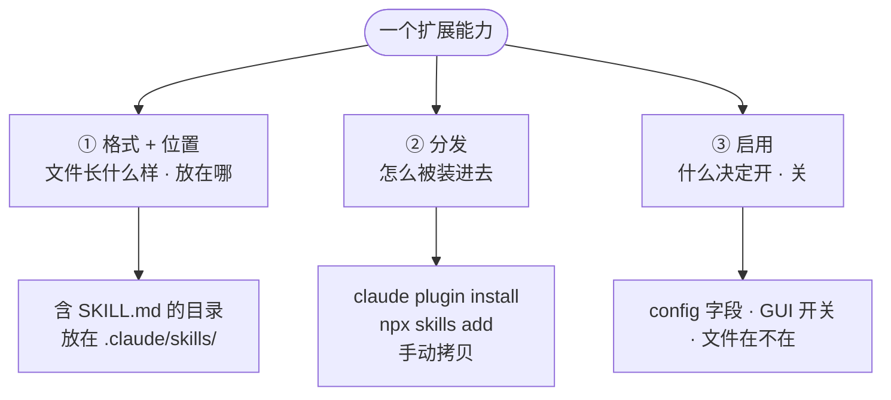
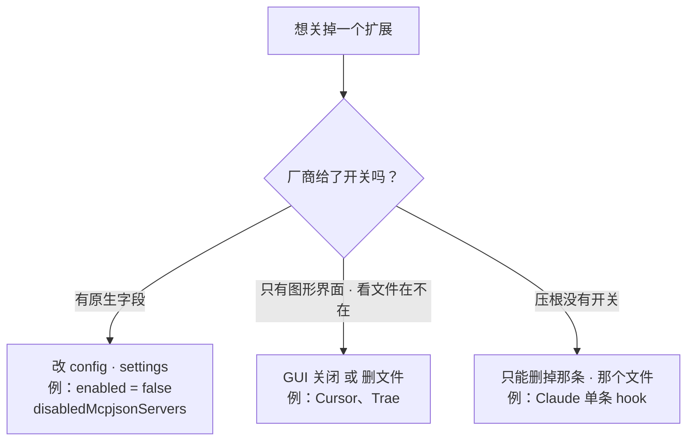
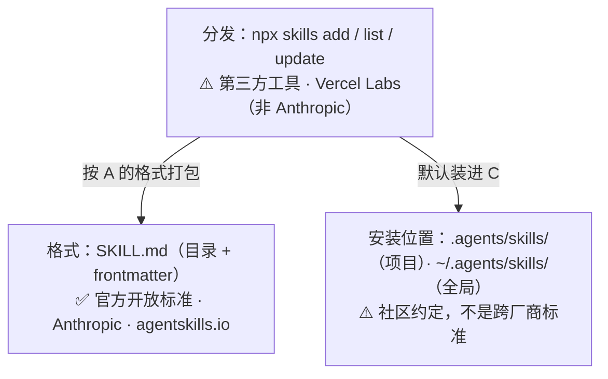
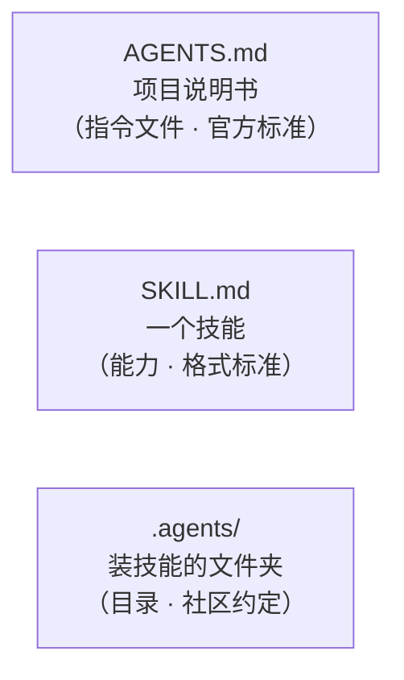

# 各 Coding Agent 如何识别与禁用扩展

> 纯理论学习材料：讲清 Codex、Claude Code、Cursor、Trae 如何识别扩展、如何禁用扩展，以及 `npm` / `.agents/` 那套约定到底是什么。本文是 2026-05-30 的快照——这些工具迭代很快，下文的具体路径、字段名以你本机安装的版本为准。
>
> 文中的图为 Mermaid，GitHub 等支持 Mermaid 的查看器会渲染成图。

## 一个心智模型：扩展 = 放在约定位置的文件

四个 Agent 都没有任何"扩展中心"或注册服务。它们启动时只做一件事：**扫描几个约定好的目录，解析里面的文件**。所以要看懂任意一个 Agent 的扩展，只需问三个**互相独立**的问题：



| 问题 | 名字 | 例子 |
|------|------|------|
| 文件长什么样、放在哪？ | **格式 + 位置** | 一个含 `SKILL.md` 的目录，放在 `.claude/skills/` |
| 它怎么被装进去的？ | **分发** | `claude plugin install`、`npx skills add`、手动拷贝 |
| 什么决定它开还是关？ | **启用** | config 里的一个字段、一个 GUI 开关、或仅看文件在不在 |

这三件事彼此独立：同一种 `SKILL.md` 格式，可以用三种方式分发，又可以用三种机制启用。下面三节按这三个问题展开。

---

## 1. 它们如何识别扩展？

所有 Agent 的"发现"都是同一条流水线——**扫已知目录 → 匹配已知文件名 → 解析注册**：


各 Agent 实际扫描的目录，可以画成一张文件系统地图：

```text
用户级（个人，全局生效）
├─ ~/.codex/
│  ├─ config.toml          # MCP、plugins、hooks、skills 开关都在这
│  └─ plugins/cache/       # 插件产物缓存
├─ ~/.claude/
│  ├─ settings.json        # hooks、enabledPlugins、各种开关
│  ├─ skills/<name>/SKILL.md
│  └─ plugins/cache/
├─ ~/.agents/skills/       # npx skills 的全局安装位置（跨 Agent 约定）
└─ ~/.cursor/mcp.json      # Cursor（Trae 也复用它）

项目级（随仓库走，团队共享）
├─ .codex/config.toml
├─ .claude/
│  ├─ settings.json
│  ├─ commands/<name>.md
│  └─ skills/<name>/SKILL.md
├─ .cursor/rules/*.mdc     #（旧版写法：根目录 .cursorrules）
├─ .trae/rules/project_rules.md
├─ .agents/skills/         # npx skills 的项目安装位置
├─ .mcp.json               # 项目级 MCP（Claude）
└─ AGENTS.md               # 给 Agent 的项目说明（指令文件）
```

### 共同点：技能都是 `SKILL.md`

凡是支持"技能"的 Agent，技能都是同一种东西——一个含 `SKILL.md` 的目录（Markdown 正文 + YAML frontmatter）：

```markdown
---
name: code-review
description: 审查一个 PR，找出 bug 和风格问题
---

# 步骤
1. ……
```

`name`、`description` 是关键字段。这是**唯一被所有 Agent 共享的格式**，也是跨 Agent 互通的唯一基础。差异不在技能本身，而在"放哪"和"怎么装"。

### Codex

配置都在 `~/.codex/config.toml`（CLI 与桌面端共用同一个二进制）。

| 类型 | 位置 | 格式 |
|------|------|------|
| Skills | `.agents/skills/`（cwd→仓库根）、`~/.agents/skills/`、`/etc/codex/skills/` | `SKILL.md` 目录 |
| MCP | `config.toml` 的 `[mcp_servers.<name>]` 表 | TOML |
| Plugins | marketplace 安装，缓存于 `~/.codex/plugins/cache/` | `.codex-plugin/plugin.json` |
| Hooks | `hooks.json` / config 的 `[hooks]` | event→matcher→hooks[] |
| Instructions | 分层 `AGENTS.md`（根→cwd，后覆盖前） | Markdown |
| Commands | `~/.codex/prompts/*.md`（已废弃，转向 skills） | Markdown |

一个 Codex 的 MCP server：

```toml
[mcp_servers.github]
command = "npx"
args = ["-y", "@modelcontextprotocol/server-github"]
```

### Claude Code

配置分层：`~/.claude/settings.json`（用户）→ `.claude/settings.json`（项目）→ `.claude/settings.local.json`（本地）。注意**技能的优先级与此相反**：企业 > 个人 > 项目。

| 类型 | 位置 | 格式 |
|------|------|------|
| Skills | `~/.claude/skills/<name>/SKILL.md`、`.claude/skills/<name>/SKILL.md`、插件内 | `SKILL.md` 目录；目录名即 `/命令` |
| Commands | `.claude/commands/<name>.md`（已并入 skills） | Markdown |
| Plugins | marketplace 记于 `~/.claude/plugins/known_marketplaces.json`，缓存于 `~/.claude/plugins/cache/` | `.claude-plugin/plugin.json` |
| Hooks | 任意 settings 的顶层 `hooks` 键 + 插件 `hooks/hooks.json` | event→matcher→hooks[] |
| MCP | 项目 `.mcp.json`；用户级在 `~/.claude.json` | `mcpServers` 映射 |
| Memory/Rules | 分层 `CLAUDE.md` + `.claude/rules/*.md` | Markdown |

同一个 GitHub MCP server，在 Claude 里是 JSON（`.mcp.json`）：

```json
{
  "mcpServers": {
    "github": { "command": "npx", "args": ["-y", "@modelcontextprotocol/server-github"] }
  }
}
```

> **教学点：同一个概念，不同格式。** 上面两段描述的是**同一个** MCP server——Codex 用 TOML 表，Claude 用 JSON 映射。这是讲给别人时最好的例子：扩展的"概念"（MCP、Hook、Skill）跨 Agent 通用，但每个 Agent 用自己的配置格式去写它。

一条 Claude hook 是 event→matcher→handler 三层：

```json
{
  "hooks": {
    "PreToolUse": [
      { "matcher": "Bash", "hooks": [ { "type": "command", "command": "~/lint.sh" } ] }
    ]
  }
}
```

读法：在执行 `Bash` 工具调用之前（`PreToolUse` + `matcher: "Bash"`），运行 `~/lint.sh`。一个 settings 文件里能注册很多这样的 handler，所以谈"一个 hook"时，指的是某个 `事件 → 匹配器 → 处理器`，而不是整个文件。

### Cursor 与 Trae

这两个简单得多：**只有 rules + MCP**，没有可比的 skill/plugin/hook 体系。

| Agent | Rules | MCP |
|-------|-------|-----|
| Cursor | `.cursor/rules/*.{md,mdc}`、旧版 `.cursorrules`、也读 `AGENTS.md` | `.cursor/mcp.json`、`~/.cursor/mcp.json` |
| Trae | `.trae/rules/project_rules.md`、`user_rules.md` | `.trae/mcp.json`、全局复用 `~/.cursor/mcp.json` |

**本节小结（可直接讲）：** 所有 Agent 都是"扫目录 + 读文件"。技能（`SKILL.md`）是唯一统一的格式；plugin/hook/MCP/rules 各家位置和格式不同，但概念能一一对上。Cursor/Trae 只玩 rules + MCP。

---

## 2. 它们如何禁用？

**关键：「禁用」不是一个动作，而是三种完全不同的机制。** 先看一张判定图：



1. **原生开关**——改 config/settings 里的一个字段。可逆，是最干净的方式。
2. **GUI / 文件在不在**——靠图形界面开关，或靠文件存在与否（Cursor、Trae）。
3. **只能删**——没有开关，想关只能删文件（如 Claude 的单条 hook）。

逐格对照：

| Agent · 类型 | 开关真相在哪 | 怎么关 | 属于哪种 |
|--------------|--------------|--------|----------|
| Codex · plugin | `config.toml` 的 `[plugins."x@mp"].enabled` | 写 `enabled = false`（**无** `codex plugin disable` 命令） | 原生开关 |
| Codex · skill | `config.toml` 的 `[[skills.config]]`，以**路径**为键 | 给该路径写 `enabled = false`（仅对 Codex 生效） | 原生开关 |
| Claude · plugin | `settings.json` 的 `enabledPlugins` | `claude plugin disable <sel> --scope <s>`（**项目级压用户级**） | 原生开关 |
| Claude · skill | `settings.json` 的 `skillOverrides.<name>` | 设为 `"off"` | 原生开关 |
| Claude · MCP | `settings.json` 的 `disabledMcpjsonServers` | 把 server 名加进该数组 | 原生开关 |
| Claude · hook | （没有逐条开关） | **只能删**那条 JSON；或 `disableAllHooks: true` 全关 | 只能删 |
| Cursor · rule | `.mdc` frontmatter + 设置开关 | 设 `alwaysApply: false`，或删文件 | GUI/文件 |
| Cursor · MCP / Trae · MCP | GUI | 界面里关 | GUI |
| Trae · rule | 文件在不在 | 删 `project_rules.md` / `user_rules.md` | 文件存在 |

两个最有代表性的"原生开关"例子：

```toml
# Codex 关一个插件
[plugins."my-plugin@my-marketplace"]
enabled = false

# Codex 关一个（非插件）技能：以 SKILL.md 的路径为键
[[skills.config]]
path = "~/.agents/skills/code-review/SKILL.md"
enabled = false
```

> **能不能优雅地禁用，取决于厂商给没给开关。** 很多东西（如 Claude 单条 hook）根本没有开关，只能删——这不是缺陷，是这些扩展类型本就没设计"关闭"状态。

> **已知坑（社区报告，用前先测）：** Codex 插件禁用有被报告不生效的 issue（17588 / 14161 / 23987）；Claude `skillOverrides` 也有报告无效的情况（50631），且它对**插件里的**技能不起作用（那些走 `/plugin`）。

---

## 3. `npm` 装 skill、装进 `.agents/` 到底是怎么回事？

**先给结论：方向是对的，但要分清三层——只有一层是官方的。**



- 你记得的 `npx skills`：**真的存在**，但它是 **Vercel Labs** 做的第三方 npm 工具（包名 `skills`，registry `skills.sh`），**不是 Anthropic 出的**。
- 你记得的"装进 `.agents/`"：**确实是默认行为**，但 `.agents/` **不是**任何官方跨厂商标准，就是这个 Vercel 工具的约定（Codex 后来也跟着用 `.agents/skills` 做发现）。
- 真正官方的，只有 **`SKILL.md` 这个文件格式**——Anthropic 把它开源成了标准（agentskills.io）。

| 层 | 是什么 | 谁定的 | 性质 |
|----|--------|--------|------|
| 格式 | `SKILL.md`（目录 + frontmatter） | Anthropic（agentskills.io） | **官方开放标准** |
| 分发 | `npx skills add / list / update / remove` | Vercel Labs | 第三方工具 |
| 安装位置 | `.agents/skills/`、`~/.agents/skills/` | Vercel 约定 | 社区约定，非标准 |

**`npx skills` 把技能装到哪**（按 Agent 不同）：

| 作用域 | 多数 Agent | Claude Code | Trae |
|--------|------------|-------------|------|
| 项目 | `.agents/skills/` | `.claude/skills/` | `.trae/skills/` |
| 全局 | `~/.agents/skills/` | `~/.claude/skills/` | — |

**lock 文件（容易记成一个，其实是两个，分属两个作用域）：**
- 项目级 `skills-lock.json`——放仓库根、入 Git、用于团队可复现安装（`npx skills install` 还原）。
- 全局级 `.skill-lock.json`——放 `~/.agents/`（或 `$XDG_STATE_HOME/skills/`）。

最后是最容易讲混的三个名字，它们是三件不同的东西：



> 一个是**说明书**、一个是**能力**、一个是**放能力的文件夹**——别混。`AGENTS.md` 是另一个独立的官方标准（agents.md，Linux Foundation 托管），跟 `SKILL.md`、`.agents/` 没有从属关系。

---

## 一页速记（讲给别人时的主线）

1. **扩展 = 放在约定目录里的文件。** 看任何 Agent 只问三件独立的事：文件放哪、怎么装的、什么决定开关。
2. **技能（`SKILL.md`）是唯一统一的格式；plugin/hook/MCP/rules 各家位置和格式不同，但概念对得上。** Cursor/Trae 只有 rules + MCP。
3. **「禁用」有三种：原生开关 / GUI 或文件存在 / 只能删。** 能不能优雅关掉，看厂商给没给开关。
4. **`npx skills` 装进 `.agents/` 是真的，但那是 Vercel 第三方工具 + 社区约定；官方的只有 `SKILL.md` 格式。** 别把 `AGENTS.md`（说明书）、`SKILL.md`（能力）、`.agents/`（目录）搞混。

> **实践提醒：** 这些工具版本漂移很快（尤其 `npx skills`、Codex），lock 格式、参数、默认路径都可能变；演示前用 `--help` 对一下当前版本。另外有些文件确实存在但官方文档没写（如 Claude 的 `~/.claude/plugins/installed_plugins.json`），一切以你本机实际为准。

---

## 来源

**厂商文档**
- Claude Code：[skills](https://code.claude.com/docs/en/skills) · [plugins](https://code.claude.com/docs/en/plugins-reference) · [marketplaces](https://code.claude.com/docs/en/plugin-marketplaces) · [hooks](https://code.claude.com/docs/en/hooks) · [MCP](https://code.claude.com/docs/en/mcp) · [settings](https://code.claude.com/docs/en/settings) · [memory](https://code.claude.com/docs/en/memory)
- Codex：[skills](https://developers.openai.com/codex/skills) · [MCP](https://developers.openai.com/codex/mcp) · [plugins](https://developers.openai.com/codex/plugins) · [config reference](https://developers.openai.com/codex/config-reference) · [AGENTS.md guide](https://developers.openai.com/codex/guides/agents-md)
- Cursor：[rules](https://cursor.com/docs/rules) · [MCP](https://cursor.com/docs/mcp)　|　Trae：[rules](https://docs.trae.ai/ide/rules)

**标准与生态**
- `SKILL.md` 规范 — https://agentskills.io/specification ；Anthropic skills 仓库 — https://github.com/anthropics/skills
- `AGENTS.md` 标准 — https://agents.md/
- Vercel `skills` CLI — https://github.com/vercel-labs/skills（lock 源码：`src/skill-lock.ts`）；npm — https://www.npmjs.com/package/skills ；registry — https://www.skills.sh/
