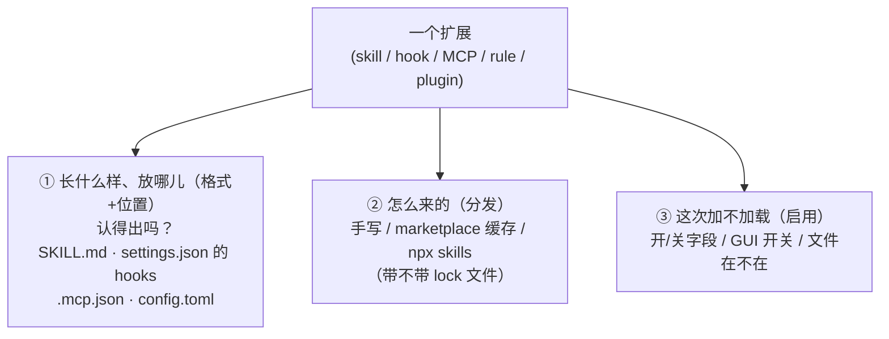
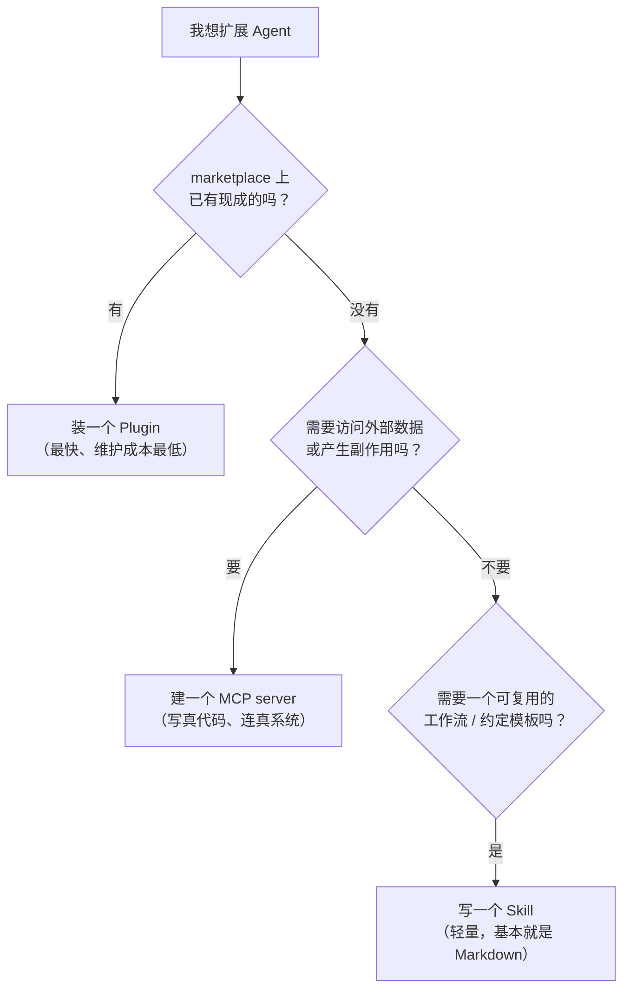
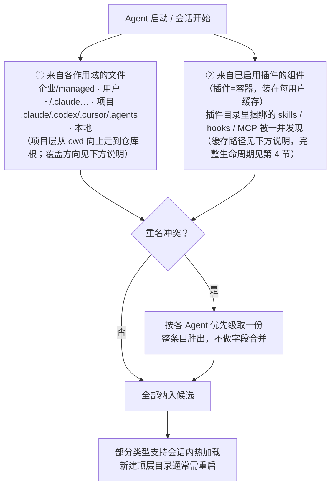
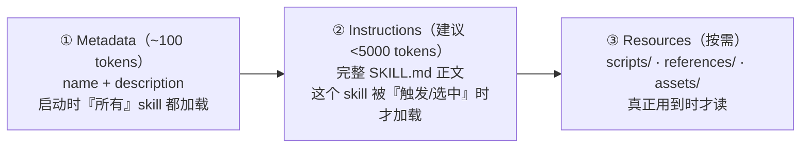
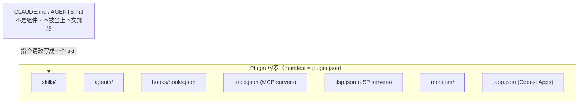
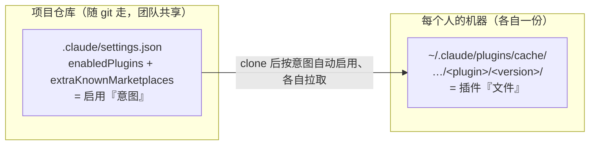
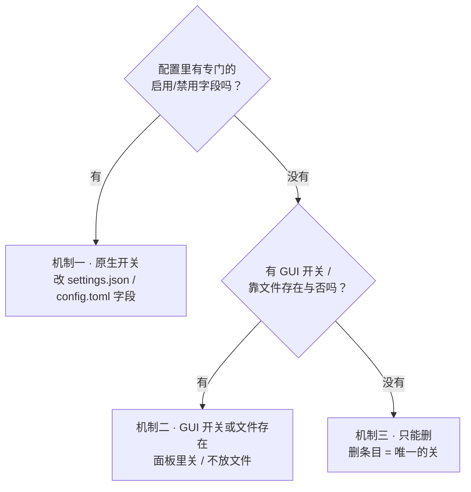
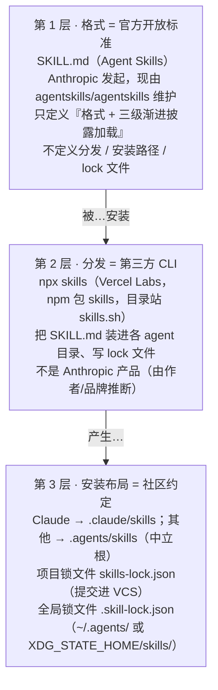
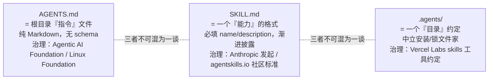

# 它们是怎么"住进"你的 Coding Agent 的

> 把 Skills / Plugins / Hooks / MCP 当成"住进来的房客"：**它们怎么被认出、怎么被请走、怎么分发进来** —— 只看 Claude Code / Codex / Cursor 三家。
>
> 纯理论教学文档 · 快照时间 **2026-05-30**。这三款工具迭代极快，路径、字段名、最低版本号都按版本而非日期标注（Claude Code 2.1.x、Cursor 2.4/2.5）；本文所有结论均带版本上下文，请当作"某个时间点的横切面"，落地前以对应官方文档为准。

本文回答两件事：**Agent 怎么"发现"一个扩展**，以及**怎么"关掉"它**。看懂之后你就能讲清楚——三款工具在"格式"上越来越像，但在"开关放哪儿"上各走各的路。

---

## 1. 心智模型：扩展 = 放在约定位置的文件

把"扩展"这个词从脑子里抽象掉。对这三款 Agent 而言，一个扩展永远只是 **一个放在约定位置、符合约定格式的文件（或目录）**。Agent 启动时扫这些位置、解析这些格式、按规则决定加载谁。

看懂任何一个扩展，只要分清三个**互不相干**的问题——把它们搅在一起，就会越想越乱：

- **① 长什么样、放在哪儿？（格式 + 位置）** 它是个什么文件、该放进哪个目录。比如 `SKILL.md` 的目录、`settings.json` 里的 `hooks` 段、`.mcp.json`、`config.toml` 里的表。这一条决定 Agent **认不认得**它。
- **② 怎么来的？（分发）** 这个文件是怎么跑到你电脑上的：手写的？从 marketplace 装进缓存目录的？还是用第三方 CLI（`npx skills`）拉的？**怎么来的不改变它长什么样**，只影响它落在哪个路径、带不带 lock 文件。
- **③ 这次到底加不加载？（启用）** 文件已经在那儿了，但这次会话要不要真用它。开关可能是配置里的一个开/关字段、界面上的一个开关，或者干脆就看"文件在不在"。

一句话：**①认得出、②哪来的、③用不用，是三件分开的事。** 同一个 `SKILL.md`，长相由开放标准定义（①），可以手写也可以 `npx skills` 装（②），最后用不用又由各 Agent 自己的开关说了算（③）。



### 配套视角：每种扩展"各管什么"，以及"该用哪个"

上面三个问题讲的是系统**怎么处理**一个文件；换个角度，按**功能职责**分，能更快决定"一件事该做成什么"。一句话：

> **Skills 教 agent「怎么想 / 怎么做」，MCP 给它「能做的事」（连外部系统），Plugins 负责「打包分发」，AGENTS.md / Rules 做「导航」。**

| 能力类型 | 层定位 | 一句话职责 |
|---|---|---|
| **AGENTS.md / Rules** | 指令层 | 项目级"总则"，进入即加载，约束 agent 的默认行为与约定 |
| **Skills / Commands** | 方法层 | 可复用的任务流程，按需加载（渐进披露）；模型自动调用，或经 `/命令` 手动触发 |
| **MCP servers** | 集成层 | 以标准协议对接外部系统与实时数据，需独立实现并对外发起调用 |
| **Plugins** | 分发层 | 不新增能力，把上述组件聚合为可安装、可版本化的分发单元 |
| **Hooks** | 自动化层 | 在生命周期事件（工具调用前后、会话起止等）上强制执行命令 |

要扩展一个 Agent 时，按这个顺序问自己：



> 这套"分发层 / 外部能力层 / 约定层"的讲法，详见文末「延伸阅读」里的几篇图解与对比。

**参考资料：**
- https://agentskills.io/specification
- https://code.claude.com/docs/en/skills
- https://developers.openai.com/codex/skills
- https://cursor.com/docs/skills

---

## 2. 三个 Agent 支持哪些扩展类型

把六种常见扩展类型摆成一张表。**最关键的一行差异：Cursor 在 2.4/2.5 之前只有 Rules + MCP；2.4 起新增原生 Skills，2.5 起新增原生 Plugins 与 Hooks。** 也就是说 Cursor 历史上"只有 rules + MCP，没有 skills/plugins/hooks"的说法，在当前版本已被官方原生系统补齐——但它的 Rules 用的是独有的 `.mdc` 格式，和另外两家不一样。

| 扩展类型 | Claude Code | Codex | Cursor |
|---|---|---|---|
| **Skills**（`SKILL.md` 目录） | ✅ 原生（吸收了 commands） | ✅ 原生 | ✅ 原生（2.4 起） |
| **Commands**（斜杠命令） | ✅ 已并入 skills（`commands/*.md` 仍可用） | ⚠️ 旧 custom prompts 已废弃，由 Skills 取代 | ✅ `.cursor/commands/*.md`（中等置信） |
| **Plugins**（容器/marketplace） | ✅ 原生 | ✅ 原生 | ✅ 原生（2.5 起，Cursor Marketplace） |
| **Hooks**（事件钩子） | ✅ 原生（`settings.json`） | ✅ 原生（`hooks.json`） | ✅ 原生（2.5 起，`hooks.json`） |
| **MCP servers** | ✅ 原生（`.mcp.json` / `~/.claude.json`） | ✅ 原生（`config.toml` 表） | ✅ 原生（`mcp.json`） |
| **Rules / Instructions** | ✅ `CLAUDE.md` + `.claude/rules/*.md` | ✅ `AGENTS.md`（分层拼接） | ✅ `.cursor/rules/*.mdc` + `AGENTS.md` |

几个容易踩的点：

- **Claude Code 读 `CLAUDE.md`，不原生读 `AGENTS.md`**——后者只能通过 `@AGENTS.md` import 或 symlink 引入。
- **Codex 读 `AGENTS.md`**（分层拼接，根目录优先在前，默认上限 32 KiB）；它的"自定义 prompts"（`~/.codex/prompts/`）已废弃，官方让你改用 Skills。
- **Cursor 同时原生读 `AGENTS.md` 和 `.cursor/rules/*.mdc`**；老的单文件 `.cursorrules` 已不在当前 Rules 文档里出现（社区视为弃用，中等置信）。

**参考资料：**
- https://code.claude.com/docs/en/skills
- https://code.claude.com/docs/en/plugins-reference
- https://developers.openai.com/codex/skills
- https://developers.openai.com/codex/custom-prompts
- https://cursor.com/docs/skills
- https://cursor.com/docs/plugins
- https://cursor.com/docs/hooks
- https://cursor.com/changelog/2-4
- https://cursor.com/changelog/2-5
- https://cursor.com/docs/context/rules

---

## 3. 它们如何「发现」扩展

三家共享同一套抽象骨架：扩展来自**两类来源**——① **来自各作用域的文件**（作用域 = 企业 / 用户 / 项目 / 本地，按就近覆盖），② **来自已启用插件的组件**（插件是容器，把捆绑的 skills/hooks/MCP 带进来）；两边汇到一起，重名时按各 Agent 的优先级取一份。下面逐 Agent 拆开，先看流程，再看路径与格式。



> **先分清两个反复出现、又最容易混的词：**
> - **作用域 = 谁控制、放在哪**：同一份配置/扩展按"谁控制、放哪"分成几档——企业（管理员统一下发、个人改不了）、个人（`~/`，跨你所有项目）、项目（仓库内、随 git 共享）、本地（项目内但 gitignore）。**三家的层级类似但命名不同，各有出处**（下面只列"有哪些档"，**不代表覆盖顺序**）：
>     - Claude Code = 企业（`managed`）/ 用户（`user`）/ 项目（`project`）/ 本地（`local`），见 [settings](https://code.claude.com/docs/en/settings)
>     - Codex = 系统（`/etc/codex`）/ 用户（`~/.codex`）/ 配置档（`--profile`）/ 项目（`.codex`）/ 命令行（`-c`），见 [config](https://developers.openai.com/codex/config-reference)
>     - Cursor = 企业（`Enterprise`）/ 团队（`Team`）/ 项目（`Project`）/ 用户（`User`），见 [hooks](https://cursor.com/docs/hooks)
>
>   下面每种类型都按各自的作用域分层。**覆盖方向别想当然**：多数情况是"更具体的盖过更宽的"，即 **项目 > 用户**（Claude 的 settings/plugins、Codex 的 `.codex` 盖 `~/.codex`、Cursor 都如此）。两个容易记反的点：① **治理层位置不一**——Claude `managed`、Cursor `Enterprise` 在**最上**（盖一切），但 Codex `/etc/codex` 在**最底**（系统基线、会被覆盖）；② **唯一的方向反转**是 **Claude 的 skills：个人 > 项目**（其余都是项目 > 用户，详见 Claude Skills 一节）。
> - **Plugin 不是这节的"类型"**：它是把上面这些类型**打包成一个可安装单元**的容器，不是新的发现格式。**插件本体装在"每用户缓存"里**，启用后其中捆绑的 skills/hooks/MCP 才被发现：
>     - Claude Code：`~/.claude/plugins/cache/<市场>/<插件>/<版本>/`
>     - Codex：`~/.codex/plugins/cache/$MARKET/$PLUGIN/$VERSION/`
>     - Cursor：本地测试在 `~/.cursor/plugins/local/<插件>/`（市场安装路径官方未细说）
>
>   这些路径的来源以及加载/配置/更新，见第 4 节。另外 **"企业作用域" ≠ plugin**——企业作用域管的是 settings/rules/skills 等一切；所谓"企业 plugin"，只是管理员在企业作用域强制下发的某个 plugin 而已。

### Claude Code

**Skills**（来源：[skills](https://code.claude.com/docs/en/skills)、[commands](https://code.claude.com/docs/en/commands)）：每个 skill 是一个目录，里面必须有 `SKILL.md`。四个层级：个人 `~/.claude/skills/<name>/SKILL.md`、项目 `.claude/skills/<name>/SKILL.md`、插件 `<plugin>/skills/<name>/SKILL.md`、企业（由组织管理员经 managed settings 统一下发、个人改不了；官方没公布具体目录路径，故此处从略）。目录名即 `/name` 命令。斜杠命令已并入 skills：`.claude/commands/<name>.md`（用户级 `~/.claude/commands/`）照样生成 `/name`，命令名取自文件名。推荐写 `description` 字段（用于自动加载）。

**Skill 优先级**（重名时）：**企业 > 个人 > 项目**。插件 skill 用 `plugin-name:skill-name` 命名空间，永不冲突。skill 与同名 command 撞名时 **skill 胜**。注意这个"个人优先于项目"的方向，**和 `CLAUDE.md` 内存的优先级（项目优先于用户）正好相反**。

项目 skill 从起始目录的 `.claude/skills/` 一路向上走到仓库根加载；子目录里的嵌套 `.claude/skills/`（monorepo）按需加载；`--add-dir` 会带上该目录的 `.claude/skills/`（但不带 subagents/commands）。会话内会监听 skill 目录变更并热加载；但**会话开始时不存在的顶层 skills 目录，新建后需要重启**。

**Hooks**（来源：[hooks](https://code.claude.com/docs/en/hooks)）：配在 `settings.json` 顶层 `hooks` 键下，按事件名分组；每个事件是一个数组，每项含可选 `matcher` 和一个 `hooks[]` 处理器数组，处理器带 `type`（`command` / `http` / `mcp_tool` / `prompt` / `agent`）。定义位置：用户 `~/.claude/settings.json`、项目 `.claude/settings.json`、项目本地 `.claude/settings.local.json`（gitignore）、managed/policy、插件 `hooks/hooks.json`、以及 skill/agent frontmatter。设置优先级：**managed/CLI > settings.local.json > 项目 settings.json > 全局 ~/.claude/settings.json**；数组型设置会合并，标量型取最具体的。事件包括 `PreToolUse` / `PostToolUse` / `UserPromptSubmit` / `Notification` / `Stop` / `SubagentStop` / `PreCompact` / `SessionStart` / `SessionEnd`（较新的事件名随版本变化）。

Claude hook 示例（`settings.json`）——每次 Edit/Write 后跑 prettier：

```json
{
  "hooks": {
    "PostToolUse": [
      {
        "matcher": "Edit|Write",
        "hooks": [
          { "type": "command", "command": "jq -r '.tool_input.file_path' | xargs npx prettier --write" }
        ]
      }
    ]
  }
}
```

**MCP**（来源：[mcp](https://code.claude.com/docs/en/mcp)）：三个 scope。Local（默认，仅当前项目）存在 `~/.claude.json` 的 `projects.<path>.mcpServers` 下；Project（团队共享）存在项目**根目录**的 `.mcp.json`（不在 `.claude/` 里面）；User（所有项目）存在 `~/.claude.json`。CLI：`claude mcp add [--scope local|project|user]`。重名优先级（整条目胜出，不合并字段）：**1. Local 2. Project 3. User 4. 插件提供 5. claude.ai connectors**。项目 `.mcp.json` 的 server 使用前需批准。

两种 MCP 写法对照——同一个 stdio server，Project scope 与 Local scope 落点不同：

```jsonc
// 写法一：Project scope → 项目根 .mcp.json（团队共享，顶层就是 mcpServers）
{
  "mcpServers": {
    "my-server": { "command": "node", "args": ["server.js"], "env": {} }
  }
}
```

```jsonc
// 写法二：Local scope → ~/.claude.json，嵌在 projects.<绝对路径>.mcpServers 下（仅本机本项目）
{
  "projects": {
    "/Users/me/repo": {
      "mcpServers": {
        "my-server": { "command": "node", "args": ["server.js"], "env": {} }
      }
    }
  }
}
```

**Rules / 内存**（来源：[memory](https://code.claude.com/docs/en/memory)）：`CLAUDE.md` 按加载顺序分层（由宽到窄）：managed policy → 用户 `~/.claude/CLAUDE.md` → 项目 `./CLAUDE.md` 或 `./.claude/CLAUDE.md` → 本地 `./CLAUDE.local.md`，全部**拼接**而非覆盖；启动时从 cwd 向上把每个祖先目录的 `CLAUDE.md`/`CLAUDE.local.md` 都加载，子目录的按需加载；冲突时项目级压过用户级。Rules 是 `.claude/rules/`（项目）或 `~/.claude/rules/`（用户）里的 `.md`，递归发现；不带 `paths:` frontmatter 的规则启动时加载（优先级同 `.claude/CLAUDE.md`），带 `paths:` glob 的规则只在读到匹配文件时加载。

### Codex

**配置**（来源：[config reference](https://developers.openai.com/codex/config-reference)、[config advanced](https://developers.openai.com/codex/config-advanced)）：根在 `CODEX_HOME`（默认 `~/.codex`），文件 `$CODEX_HOME/config.toml`，分层：基础用户配置 → profile 叠加（`--profile`）→ 项目 `.codex/config.toml`（仓库根向下到 cwd）→ CLI 覆盖（`-c/--config key=value`）。项目层需要项目被信任（trusted）。（profile 与项目层的精确先后在 config-basic / config-advanced 文档间表述不一致，按中等置信处理。）

**Skills**（来源：[skills](https://developers.openai.com/codex/skills)）：目录含 `SKILL.md`，必填 frontmatter `name` 和 `description`。发现层级：仓库 `.agents/skills`（cwd 向上到仓库根）、用户 `$HOME/.agents/skills`、系统 `/etc/codex/skills`、以及 Codex 内置。可选子目录 `scripts/` `references/` `assets/` `agents/`。文档**未给同名 skill 的覆盖层级**——同名不合并，两份都可能出现在选择器里。

**Hooks**（来源：[hooks](https://developers.openai.com/codex/hooks)）：事件/matcher/handler 模型，定义在 `hooks.json`（及 config 内联表）。事件从 `SessionStart` 到 `Stop`；matcher 是正则；handler **只支持 command 类型**。项目级 hook 需项目被信任。

**MCP**（来源：[mcp](https://developers.openai.com/codex/mcp)、[issue 16439](https://github.com/openai/codex/issues/16439)）：在 `config.toml` 里以 `mcp_servers.<name>` 表定义（用户级 + 受信项目级）。必须有 stdio `command`，可选 `args`/`env`/`env_vars`/`cwd`。CLI：`codex mcp add`。**没有第一方的 per-server 启用/禁用命令**（issue 16439 仍在请求中），启用状态靠改 `config.toml`。

### Cursor

**Skills**（2.4 起，原生，实现开放标准；来源：[skills](https://cursor.com/docs/skills)、[2.4 changelog](https://cursor.com/changelog/2-4)）：每个 skill 是含 `SKILL.md` 的目录，`name`（小写字母数字连字符）须与父目录同名，必填 `name`/`description`，可选 `paths`/`disable-model-invocation`/`metadata`。自动发现自：项目 `.agents/skills/` 与 `.cursor/skills/`；用户 `~/.agents/skills/` 与 `~/.cursor/skills/`；以及兼容旧目录 `.claude/skills/`、`.codex/skills/`（项目）和 `~/.claude/skills/`、`~/.codex/skills/`（home）。支持 monorepo 嵌套子目录，可在斜杠菜单调用。

**Rules**（来源：[rules](https://cursor.com/docs/context/rules)）：`.cursor/rules/` 里的 `.mdc` 文件（带 YAML frontmatter `alwaysApply`/`description`/`globs`）；**该目录里的纯 `.md` 会被规则系统忽略**。四种应用方式：Always / Apply Intelligently / Apply to Specific Files / Apply Manually。User Rules 全局生效；**Team Rules 优先于 Project 和 User Rules**。Cursor 也原生读 `AGENTS.md`（根目录及任意子目录，嵌套就近生效）。

**MCP**（来源：[mcp](https://cursor.com/docs/mcp)）：项目 `.cursor/mcp.json`、全局 `~/.cursor/mcp.json`，顶层 `mcpServers` 对象（stdio 用 `command`/`args`/`env`，远程用 `url`）。**项目与全局之间的优先级官方未说明**，任何优先级断言都未经证实。

**Hooks**（2.5 起；来源：[hooks](https://cursor.com/docs/hooks)）：`hooks.json`，三个 scope——项目 `.cursor/hooks.json`、用户 `~/.cursor/hooks.json`、企业（macOS `/Library/Application Support/Cursor/hooks.json` 等）。JSON 形如 `version: 1` 加一个 `hooks` 对象，每个 hook 名映射到一组带 `command` 路径的对象。事件含 `sessionStart`/`sessionEnd`/`preToolUse`/`postToolUse`/`beforeShellExecution` 等（单次抓取，可能漂移）。优先级**由高到低：Enterprise > Team > Project > User**。

### 跨切面：渐进式披露（Skill 的三阶段加载）

三家（以及 Agent Skills 标准本身）都用同一招控制上下文：**skill 不是一次性全读进来，而是按需分三阶段加载**。这是"为什么能装很多 skill 还不爆上下文"的关键——也是 skill 和"一股脑塞进 `CLAUDE.md`"的本质区别。



对应 Codex 的说法：先只看到每个 skill 的 `name`/`description`/路径 → 决定用它时才读完整 `SKILL.md` → 执行中按需加载脚本与参考。所以 **`description` 写得好不好，直接决定 skill 会不会被选中**：

```yaml
# 好的 description：说清「做什么 + 何时用」，并把触发关键词前置
description: 提取 PDF 文本与表格、填写 PDF 表单、合并多个 PDF。处理 PDF 文档、或用户提到 PDF/表单/文档提取时使用。

# 差的 description：太宽泛，既难被精准触发，又容易到处误触发
description: 帮你处理 PDF。
```

> **一个常见失败模式：** description 写得太宽 → 要么匹配不准、要么到处误触发，把上下文撑大。Codex 还会把"已安装 skill 列表"压到约 **2% 上下文窗口**，skill 太多时**先砍 description、再可能整条省略**——所以官方建议：描述简短、边界清晰、**核心用途和触发词前置**；并把 `SKILL.md` 正文控制在 **500 行以内**，细节挪到 `references/`。

**参考资料：**
- https://agentskills.io/specification
- https://code.claude.com/docs/en/skills
- https://code.claude.com/docs/en/claude-directory
- https://code.claude.com/docs/en/commands
- https://code.claude.com/docs/en/hooks
- https://code.claude.com/docs/en/mcp
- https://code.claude.com/docs/en/memory
- https://developers.openai.com/codex/config-advanced
- https://developers.openai.com/codex/config-reference
- https://developers.openai.com/codex/skills
- https://developers.openai.com/codex/hooks
- https://developers.openai.com/codex/mcp
- https://developers.openai.com/codex/guides/agents-md
- https://github.com/openai/codex/issues/16439
- https://cursor.com/docs/skills
- https://cursor.com/docs/context/rules
- https://cursor.com/docs/mcp
- https://cursor.com/docs/hooks

---

## 4. Plugin 是个容器：它打包了什么？

Plugin 不是一种新扩展类型，而是一个**把若干扩展打包到一起、可一键分发安装的容器**。安装时被复制进**每用户的版本化缓存**，而不是原地使用。理解 plugin 的关键是看清"盒子里装哪些组件"。

**Claude plugin** 的清单是 `.claude-plugin/plugin.json`，**所有其他组件目录都在 plugin 根目录**（不在 `.claude-plugin/` 里面）：

| 组件 | 位置 |
|---|---|
| Manifest | `.claude-plugin/plugin.json` |
| Skills | `skills/`（含 `<name>/SKILL.md`）— 也可从 `commands/` 或根目录单个 `SKILL.md` 发现 |
| Commands | `commands/`（扁平 `.md`，已并入 skills） |
| Agents | `agents/` |
| Hooks | `hooks/hooks.json` |
| MCP servers | `.mcp.json` |
| LSP servers | `.lsp.json` |
| Monitors | `monitors/monitors.json` |
| Output styles | `output-styles/` |
| Themes | `themes/` |

分发与缓存：marketplace 由仓库根的 `.claude-plugin/marketplace.json` 目录定义；已注册的 marketplace 每用户一份存于 `~/.claude/plugins/known_marketplaces.json`；插件被复制进 `~/.claude/plugins/cache/<marketplace>/<plugin>/<version>/...`。

**Codex plugin** 的清单是 `.codex-plugin/plugin.json`，打包 **Skills / Apps / MCP servers**：一个 `skills/` 目录、一个 `hooks/` 生命周期钩子目录、一个 `.app.json`（apps/connectors）、一个 `.mcp.json`（MCP servers）外加 assets。安装进 `~/.codex/plugins/cache/$MARKETPLACE/$PLUGIN/$VERSION/`；marketplace 由 `.agents/plugins` 下的 `marketplace.json` 定义。**`AGENTS.md` 与独立 commands 不是 Codex plugin 组件**（由组件清单中缺席推断，中等置信）。

> **关键且常被误解的一点（官方逐字确认）：`CLAUDE.md` / `AGENTS.md` 不是 plugin 组件。** Claude 官方 plugins-reference 原文：*"A CLAUDE.md file at the plugin root is not loaded as project context. Plugins contribute context through skills, agents, and hooks rather than CLAUDE.md. To ship instructions that load into Claude's context, put them in a skill."* 也就是说——**放在 plugin 根目录的 `CLAUDE.md` 不会被当成上下文加载**。想随 plugin 分发指令，必须把它写成一个 skill。Codex 侧同理，`AGENTS.md` 也不在 plugin 组件清单内。



Plugin 的另一半是**生命周期**：它怎么被**加载**（哪个作用域）、怎么**配置**、怎么**更新**。先看三家速览：

| 维度 | Claude Code | Codex | Cursor（2.5） |
|---|---|---|---|
| 安装作用域 | user / project / local / managed | **仅 user（电脑级）** | project 或 user |
| 启用状态存哪 | `enabledPlugins`（对应作用域的 `settings.json`） | `~/.codex/config.toml` 的 `[plugins."…"]` | GUI / 分发组 |
| 文件缓存（每用户） | `~/.claude/plugins/cache/<mp>/<plugin>/<ver>/` | `~/.codex/plugins/cache/$MP/$PLUGIN/$VER/` | 本地测试 `~/.cursor/plugins/local/` |
| 更新命令 | `claude plugin update` | `codex plugin marketplace upgrade` | marketplace 托管（审核后发布） |
| 版本机制 | `version` 钉死，否则用 git SHA；旧版 ~7 天清理 | manifest `version` | 审核发布 |

### 加载：电脑级 vs 项目级

要分清两件事：**"装在哪个作用域"（决定谁能用、配置写进哪个文件）** 和 **"文件落在哪"（几乎都在每用户缓存）**。

**Claude Code** 安装时选作用域（`claude plugin install <plugin> -s user|project|local`，默认 user）：

| 作用域 | 启用意图写进 | 用途 |
|---|---|---|
| `user` | `~/.claude/settings.json` | 个人，跨所有项目（默认） |
| `project` | `.claude/settings.json` | 团队，随仓库进版本控制 |
| `local` | `.claude/settings.local.json` | 仅本项目，gitignore |
| `managed` | 企业 managed settings | 企业下发，只读、仅可更新 |

关键点：**不管哪个作用域，启用状态都只是 `enabledPlugins` 里的一个布尔（`plugin@marketplace: true/false`）；插件文件本身永远复制进"每用户"的版本化缓存。** 所以"项目级 plugin" = 把启用意图写进随仓库走的 `.claude/settings.json`（配合 `extraKnownMarketplaces` 预注册 marketplace），让 clone 仓库的人自动启用——但每个人的机器各自缓存一份文件：



另外两点：marketplace 注册表是每用户的 `~/.claude/plugins/known_marketplaces.json`；一个特例是 **skills 目录里**任何带 `.claude-plugin/plugin.json` 的文件夹，会以 `<name>@skills-dir` **就地加载、无需安装、不进缓存**（本地开发最省事）。插件里的 MCP server 在插件**启用时自动启动**。

**Codex**：**只有电脑级（user scope），没有项目级安装**。插件统一装进 `~/.codex/plugins/cache/$MARKETPLACE/$PLUGIN/$VERSION/`（本地插件版本号为 `local`），启用状态在 `~/.codex/config.toml` 的 `[plugins."name@marketplace"]`。注意 marketplace 可以是仓库级（`$REPO_ROOT/.agents/plugins/marketplace.json`）或个人级（`~/.agents/plugins/marketplace.json`），但插件本身都落到用户缓存。

**Cursor**（2.5）：可**项目级或用户级**安装；清单 `.cursor-plugin/plugin.json`（多插件仓库加 `.cursor-plugin/marketplace.json`）。团队 marketplace 在 Dashboard → Settings → Plugins → Import 里粘 GitHub 仓库地址、设分发组；分发组里"必装"插件自动装给所有人，"可选"的各自安装。

### 配置方式

**Claude Code**（CLI 或直接改 settings.json）：

```bash
claude plugin marketplace add <owner/repo>             # 注册一个 marketplace
claude plugin install <name>@<marketplace> -s project  # 安装并选作用域
claude plugin enable|disable <name> -s <scope>         # 开 / 关
claude plugin list                                     # 看已装版本 / 来源 / 状态
```

也可在 `.claude/settings.json` 直接写 `enabledPlugins` 与 `extraKnownMarketplaces`。插件若需要用户提供值（如 token），用 `plugin.json` 的 `userConfig` 字段——**启用时提示用户填，而非让人手改 settings**。插件内部用 `${CLAUDE_PLUGIN_ROOT}`（自身安装目录）和 `${CLAUDE_PLUGIN_DATA}`（跨版本持久状态，`~/.claude/plugins/data/<id>/`）引用文件。

**Codex**：

```bash
codex plugin marketplace add owner/repo [--ref main] [--sparse PATH]
codex plugin marketplace list | remove <name>
```

安装/开关也可在 `/plugins` 浏览器里做（选中按 Space 切换启用），或直接改 `config.toml` 的 `[plugins."x@mp"] enabled`。**没有 `codex plugin disable` 子命令**——禁用 = 改 config + 重启。

**Cursor**：走 GUI——Cursor 内的 marketplace 面板或 cursor.com/marketplace 安装；组件路径从默认目录自动发现，也可在 `.cursor-plugin/plugin.json` 指定自定义路径。

### 更新方式

**Claude Code**：`claude plugin update <plugin> [-s <scope>]` 更新到最新版。版本怎么算是关键：

- `plugin.json` 写了 `version` → **钉死版本**，只有作者 bump 版本号用户才会收到更新（光推新 commit 不够）。
- 不写 `version` → 回退到**源码的 git commit SHA**，于是每个 commit 都算新版本（适合快速迭代）。
- 每个版本是缓存里独立的目录；更新/卸载后旧版本目录被标记为孤儿，**约 7 天后自动清理**（给还在运行的会话留缓冲）。
- 会话中途更新：hooks/MCP/LSP 仍用旧路径，跑 `/reload-plugins` 切到新版；monitors 需重启会话。`${CLAUDE_PLUGIN_DATA}` 跨版本保留。

**Codex**：`codex plugin marketplace upgrade [marketplace-name]` 刷新 marketplace（manifest 带 `version` 字段）；每插件的精确升级流程官方着墨不多，多数变更要**重启 Codex** 才生效。

**Cursor**：更新由 marketplace 托管——官方要求插件开源、每次更新人工审核后发布；面向用户的具体更新/回滚流程文档未细说（低置信）。

**参考资料：**
- https://code.claude.com/docs/en/plugins-reference
- https://code.claude.com/docs/en/plugin-marketplaces
- https://code.claude.com/docs/en/discover-plugins
- https://code.claude.com/docs/en/settings
- https://developers.openai.com/codex/plugins
- https://developers.openai.com/codex/plugins/build
- https://cursor.com/docs/plugins
- https://agents.md/

---

## 5. 它们如何「禁用」扩展

启用状态没有跨 Agent 的统一 schema——**每家把开关放在自己的配置或 UI 里**。归纳成三种机制：

1. **原生开关（Native flag）**：配置里有个布尔/枚举字段，改它即可。最干净。
2. **GUI 开关或"文件存在与否"**：状态不在你能 grep 的 JSON 里，而在 IDE 设置面板里；或者干脆"删掉文件 = 禁用"。
3. **只能删（Delete-only）**：没有单项开关，唯一的"关"就是删除该条目。



逐格对照表：

| Agent · 类型 | 启用状态的"真相"在哪 | 禁用动作 | 机制 |
|---|---|---|---|
| **Claude · Plugins** | `settings.json` 的 `enabledPlugins` 映射（`plugin@marketplace: true/false`） | `claude plugin disable`（`-s user/project/local`）；`defaultEnabled` v2.1.154+ 仅在无条目时兜底 | 原生开关 |
| **Claude · Skills** | `settings.local.json` 的 `skillOverrides`（`on`/`name-only`/`user-invocable-only`/`off`，v2.1.129+，不适用于插件 skill） | 设为 `off` | 原生开关 |
| **Claude · MCP** | `disabledMcpjsonServers` / `enabledMcpjsonServers` + `enableAllProjectMcpServers` | 加入 disabled 列表 | 原生开关 |
| **Claude · Hooks** | **无 per-hook 字段**，只有全局 `disableAllHooks` | 单个 hook **只能删** | 只能删 |
| **Codex · Plugins** | `~/.codex/config.toml` 的 `[plugins."…@…"]` 表 | `enabled = false` 后重启（无 `codex plugin disable` 子命令） | 原生开关 |
| **Codex · Skills** | `config.toml` 的 `[[skills.config]]` 数组（用 `path` 指向 SKILL.md） | `enabled = false` 后重启 | 原生开关 |
| **Codex · MCP** | `config.toml` 的 `mcp_servers` 表 | 改 config.toml（无确认的 per-server CLI，issue 16439） | 原生开关 |
| **Cursor · Rules** | `.mdc` 的 `alwaysApply`/`globs`/`description` 决定激活；无供用户切换的布尔 `enabled` 键 | Settings 面板里关，或删文件；强制 Team Rules 不可关 | GUI / 删 |
| **Cursor · MCP** | 配置在 `mcp.json`，但**启用状态在 GUI 开关**（Settings → Tools and Integrations） | 面板里关；禁用的 server 不加载、不出现在 chat | GUI 开关 |

两个 `enabled = false` 的 Codex TOML 示例：

```toml
# 禁用一个 plugin（表头是 [plugins."名字@marketplace"]）—— 改完需重启 Codex
[plugins."my-plugin@my-marketplace"]
enabled = false
```

```toml
# 禁用一个 skill（[[skills.config]] 数组，用 path 指向其 SKILL.md）—— 改完需重启
[[skills.config]]
path = "/path/to/.agents/skills/my-skill/SKILL.md"
enabled = false
```

> 注意几个坑：Claude Hooks **没有单项开关**——想关掉某一个 hook 只能把它从配置里删掉（这是"flatten per handler"模型的直接后果）。Codex 多数禁用要**重启**才生效，且项目级 `skills.config` 过滤被报告有 bug（issue 20210），用户级最可靠。Cursor 的 MCP/Rules 开关在 **GUI 而非 JSON**，社区还报告过开关不能跨重启稳定保持（中等置信）。

**参考资料：**
- https://code.claude.com/docs/en/settings
- https://code.claude.com/docs/en/plugins-reference
- https://code.claude.com/docs/en/plugin-marketplaces
- https://code.claude.com/docs/en/hooks
- https://developers.openai.com/codex/plugins
- https://developers.openai.com/codex/skills
- https://developers.openai.com/codex/mcp
- https://github.com/openai/codex/issues/16439
- https://cursor.com/docs/context/rules
- https://cursor.com/docs/mcp

---

## 6. npm 装 skill、装进 `.agents/` 是怎么回事

"用 `npx skills` 装 skill、东西落进 `.agents/`、还冒出 lock 文件"——很多人把这一坨当成一个东西。其实是**三层完全独立、由三方不同主体治理**的事物叠在一起。看懂这三层，回到第 1 节那三个问题就全通了：第一层是"长什么样"（格式），第二层是"怎么来的"（分发），第三层是分发顺带留下的约定产物。



**第 1 层 — `SKILL.md` 格式（官方开放标准）**：Agent Skills 由 Anthropic 发起、开源为开放标准，现维护在独立的 `agentskills/agentskills` 仓库、规范发布于 agentskills.io。它**只定义格式与加载语义**：一个 skill 是个目录，至少含一个 `SKILL.md`（可选 `scripts/`/`references/`/`assets/`）；frontmatter 只有两个必填字段——`name`（1–64 字符，小写字母数字+连字符，须与父目录同名）和 `description`（1–1024 字符）；加载是三级渐进披露（元数据 ~100 token 启动即加载 → 指令体激活时加载 → 资源按需加载）。**它不定义分发、安装路径或 lock 文件。**

**第 2 层 — `npx skills`（第三方分发 CLI）**：这是 Vercel Labs 的工具（仓库 `vercel-labs/skills`，npm 包名 `skills`，目录/排行榜站 skills.sh），**不是 Anthropic 产品**（非关联由作者归属与品牌推断，官方页面无逐字免责声明）。它从 GitHub 仓库拉取 `SKILL.md`、装进各 agent 目录、并写 lock 文件。它和格式标准是两码事、各管各的——同一个 `SKILL.md` 你手写也行。

**第 3 层 — 安装布局与 lock 文件（CLI/社区约定，非标准）**：安装位置是 CLI 约定——**Claude Code 装进 `.claude/skills`，其他 agent 装进 `.agents/skills`**（项目与用户两个 scope）。`.agents/` 是一个**中立、工具无关的家**，对照 `~/.claude/`、`~/.cursor/` 这些 agent 专属根。两个 lock 文件：
- **项目锁 `skills-lock.json`**——放项目目录，**提交进版本控制**，团队共享，内容用 SHA-256 哈希、确定性排序以减少冲突。
- **全局锁 `.skill-lock.json`**——`XDG_STATE_HOME` 设置时在 `$XDG_STATE_HOME/skills/.skill-lock.json`，否则在 `~/.agents/.skill-lock.json`。

> 全局安装有个微妙点：`npx skills ... -g` 装进 `~/.agents/skills/`，而 Claude Code 读的是 `~/.claude/skills/`，CLI 用 symlink 桥接（且有未创建 symlink 的 bug，issue 851）。所以"`.agents/skills` 是 CLI 中立根、`.claude/skills` 是 Claude 原生读取位"，二者是被链接而非同一目录。

最后把三个最容易混的名字钉死——它们分属三个不同标准、由三个不同主体治理：



### 一点延伸：团队规模下的版本策略

把单机的 `skills-lock.json` 放到团队尺度，有两点值得记：

- **锁版本为什么用 commit / tree hash 而非 semver**：Skill 是提示词、没有"API 兼容性"概念，但对"我用的是不是和团队完全一致的那一份"极度敏感——精确哈希最不会撒谎（这也是 `skillFolderHash` 的由来）。
- **"锁定"与"跟随最新"是两种相反的诉求**：维护者要"精确锁版本 + 能把改动推回去"（lock 入 Git、显式 `update`、可 `publish`）；纯使用者要"永远最新、别打扰"（`gitignore` 忽略、安装即拉最新、不锁版本）。一套策略满足不了两边。

**参考资料：**
- https://agentskills.io/specification
- https://github.com/agentskills/agentskills
- https://github.com/vercel-labs/skills
- https://github.com/vercel-labs/skills/blob/main/src/skill-lock.ts
- https://github.com/vercel-labs/skills/issues/851
- https://www.skills.sh/
- https://agents.md/
- https://github.com/agentsmd/agents.md

---

## 7. 一页速记

讲给别人时，抓住这 4 条主线就够：

1. **扩展 = 约定位置的约定格式文件。** 永远拆成三个分开的问题：**长什么样 / 放哪儿**（认得出）、**怎么来的**（分发）、**这次用不用**（启用）。三者别混——同一个 `SKILL.md` 可以手写、可以 `npx skills` 装、是否生效又另说。

2. **发现 = 用户层 → 项目层 → 插件层，重名按优先级取一份（整条目胜出，不合并字段）。** 三家骨架一致，路径各异。记两个反直觉点：Claude 的 **skill 优先级是"个人 > 项目"**，恰好和它 `CLAUDE.md` 内存的"项目 > 用户"相反；Cursor 历史上"只有 rules + MCP"，**2.4 起补了原生 skills、2.5 起补了原生 plugins/hooks**，但 Rules 用独有的 `.mdc`。

3. **Plugin 是容器，不是新类型；`CLAUDE.md`/`AGENTS.md` 不是它的组件。** Claude plugin 装 skills/agents/hooks/MCP/LSP/monitors，Codex plugin 装 Skills/Apps/MCP。官方逐字确认：**plugin 根目录的 `CLAUDE.md` 不会被当上下文加载**——要随 plugin 分发指令，写成 skill。生命周期上记住：**插件文件永远在"每用户缓存"里，所谓"项目级"只是把启用意图写进随仓库走的 `settings.json`**；更新看版本号（Claude `version` 钉死、否则用 git SHA，旧版 7 天清理），**Codex 只有电脑级、改完多要重启**。

4. **禁用没有统一 schema，三种机制各家自理：原生开关 / GUI 或文件存在 / 只能删。** Claude 多用原生开关，但 **hook 只能删**；Codex 用 `config.toml` 的 `enabled = false`、**改完要重启**；Cursor 的 MCP/Rules 开关在 **GUI 而非 JSON**。"真相在哪个文件/面板"才是禁用问题的核心。

> 收尾提醒：本文是 **2026-05-30** 的横截面，版本锚点为 Claude Code 2.1.x、Cursor 2.4/2.5、Codex 当前文档。这些工具变得很快——把结论当指针，落地前回到对应官方文档核对路径与字段。

---

## 延伸阅读（第三方图解与对比 · 概念向）

下面几篇不是一手规范，而是把上面这些关系讲得直观的第三方材料，适合建立第一层心智模型或拿来讲课（具体事实仍以各官方文档为准）：

- **Codex plugins, visually explained** — 用几张图讲清 "Plugin = Skills + Apps/Connectors + MCP servers 的可安装 bundle"，建第一层心智模型最快。https://adithyan.io/blog/codex-plugins-visual-explainer
- **Compare Plugins vs MCP vs Skills in Claude Code** — 带对比表、决策流程图、分层架构；核心结论：Plugin = 分发层，MCP = 外部能力层，Skill = 约定/流程层。https://systemprompt.io/guides/claude-plugins-vs-mcp-vs-skills
- **The Claude Customization Stack: MCP vs Skills vs Plugins** — 同主题的另一种讲法，适合交叉印证。https://www.ado.im/posts/claude-customization-stack-mcp-skills-plugins/
- **Building Codex CLI Plugins: Architecture, Manifests, and Enterprise Distribution** — 偏深入：plugin 解剖、`.codex-plugin/plugin.json`、`skills/`、`.app.json`、`.mcp.json`、marketplace 与企业分发。https://codex.danielvaughan.com/2026/03/30/codex-cli-plugin-system/
