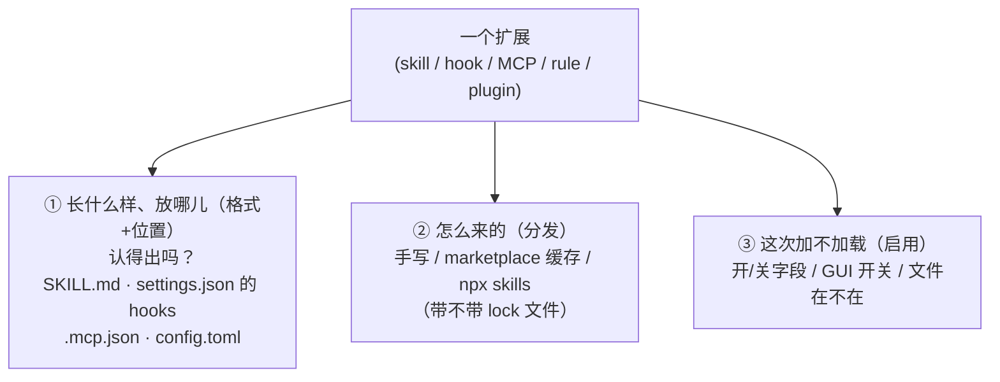
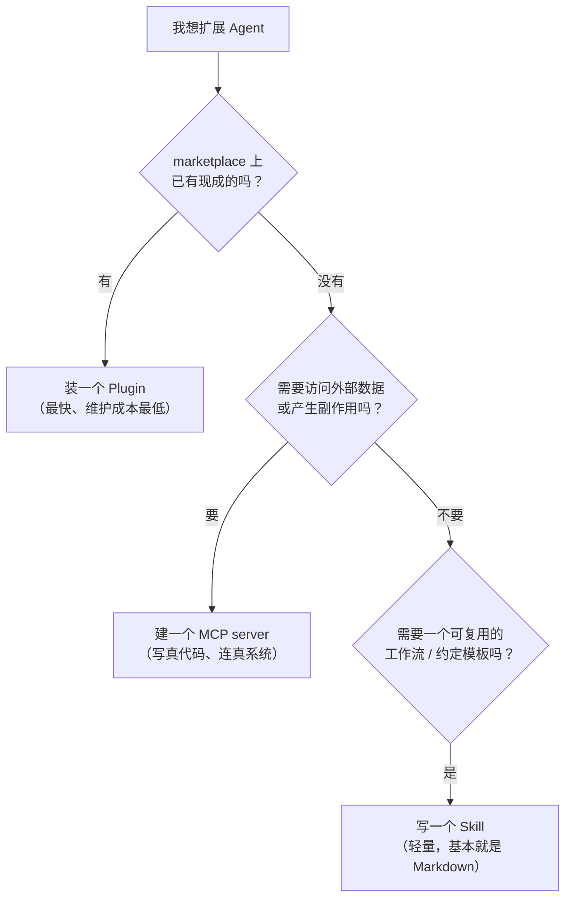
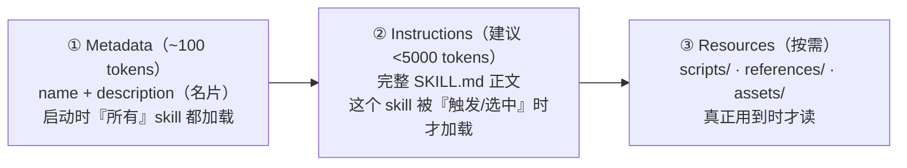
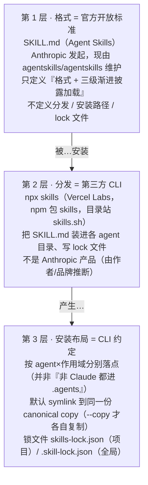
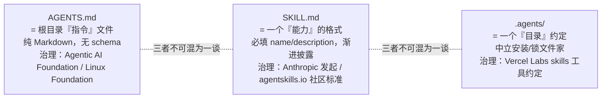
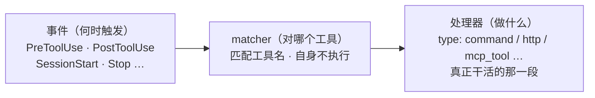
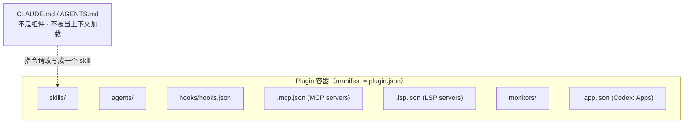
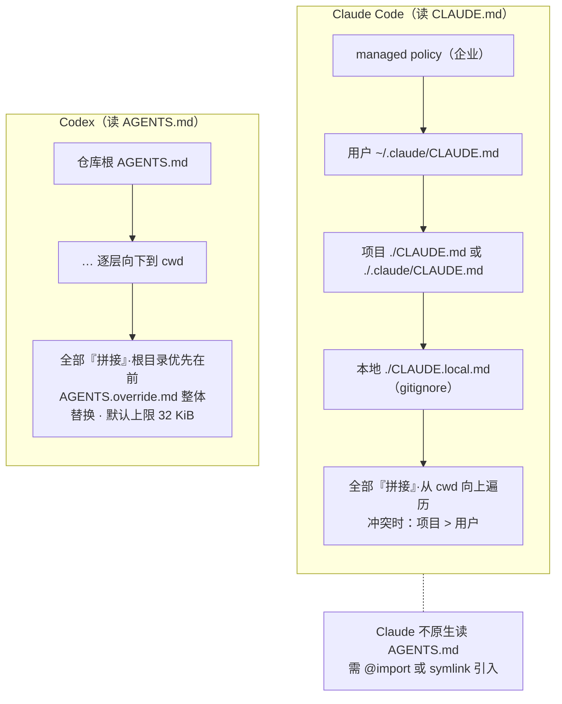

# 它们是怎么"住进"你的 Coding Agent 的

> 把 Skills / Plugins / Hooks / MCP 当成"住进来的房客"：**它们怎么被认出、怎么被请走、怎么分发进来** —— 只看 Claude Code / Codex 两家。
>
> 纯理论教学文档 · 快照时间 **2026-05-30**。这两款工具迭代极快，路径、字段名、最低版本号都按版本而非日期标注（Claude Code 2.1.x、Codex 当前文档）；本文所有结论均带版本上下文，请当作"某个时间点的横切面"，落地前以对应官方文档为准。

本文回答两件事：**Agent 怎么"发现"一个扩展**，以及**怎么"关掉"它**。看懂之后你就能讲清楚——两款工具在"格式"上越来越像，但在"开关放哪儿"上各走各的路。

---

## TL;DR

> 五类扩展、两家（Claude Code / Codex）异同一页速查；细节见下文各节。

**心智模型**：任何扩展都拆三问——**① 什么格式、放哪（认得出）· ② 怎么来的（分发）· ③ 这次用不用（启用）**。作用域「企业 > 用户 > 项目 > 本地」多按"越具体越优先（项目 > 用户）"，唯独 **Claude 的 skill 反过来：个人 > 项目**。

| 类型（层） | 一句话 | Claude vs Codex 关键差异 |
|---|---|---|
| **Skill**（方法层） | 含 `SKILL.md` 的目录，渐进披露（名片→正文→资源），`description` 决定被不被选中 | 名片清单预算 Claude **1%** / Codex **2%（或 8K 字符）**；禁用 `skillOverrides` vs `[[skills.config]]` |
| **Hook**（自动化层） | 生命周期事件上自动跑命令；三段「事件 + matcher + 处理器」，`exit 2` 拦截、stdout JSON 注入 | 事件都约 10 个；处理器 Claude 5 种 / Codex 只 `command`（**但同样能注入**）；都无 per-hook 禁用 |
| **MCP**（集成层） | 标准协议连外部系统，工具定义**延迟加载**（只露名字、用时才取） | Tool Search 仅 Claude（省 ~85% 上下文）；配置 Claude `.mcp.json` + 三作用域 / Codex `config.toml` |
| **Plugin**（分发层） | 把上面这些**打包 + 版本化 + 分发**，装进每用户缓存 | `CLAUDE.md`/`AGENTS.md` **不是组件**；Claude 四作用域 / Codex 仅电脑级 |
| **Rules**（指令层） | 进项目即加载的"总则"，多层**拼接**非覆盖 | Claude 读 `CLAUDE.md`（项目 > 用户）/ Codex 读 `AGENTS.md`（根在前、32 KiB、`override` 替换）；互不原生读对方 |

**三个最反直觉的坑**：① Skill 名片预算实按 **~200K 基线**算，1M 模型反而更早被截断；② Codex 的 skill 家是中立 **`.agents`**（不是 `.codex`），只有 Claude 才需 symlink 桥；③ **`CLAUDE.md`/`AGENTS.md` 既进不了 plugin、也不是 MCP 上下文**——想随 plugin 发指令必须写成 skill。

---

## 1. 心智模型：扩展 = 放在约定位置的文件

把"扩展"这个词从脑子里抽象掉。对这两款 Agent 而言，一个扩展永远只是 **一个放在约定位置、符合约定格式的文件（或目录）**。Agent 启动时扫这些位置、解析这些格式、按规则决定加载谁。

看懂任何一个扩展，只要分清三个**互不相干**的问题——把它们搅在一起，就会越想越乱：

- **① 长什么样、放在哪儿？（格式 + 位置）** 它是个什么文件、该放进哪个目录。比如 `SKILL.md` 的目录、`settings.json` 里的 `hooks` 段、`.mcp.json`、`config.toml` 里的表。这一条决定 Agent **认不认得**它。
- **② 怎么来的？（分发）** 这个文件是怎么跑到你电脑上的：手写的？从 marketplace 装进缓存目录的？还是用第三方 CLI（`npx skills`）拉的？**怎么来的不改变它长什么样**，只影响它落在哪个路径、带不带 lock 文件。
- **③ 这次到底加不加载？（启用）** 文件已经在那儿了，但这次会话要不要真用它。开关可能是配置里的一个开/关字段、界面上的一个开关，或者干脆就看"文件在不在"。

一句话：**①认得出、②哪来的、③用不用，是三件分开的事。** 同一个 `SKILL.md`，长相由开放标准定义（①），可以手写也可以 `npx skills` 装（②），最后用不用又由各 Agent 自己的开关说了算（③）。



### 配套视角：每种扩展"各管什么"，以及"该用哪个"

上面三个问题讲的是系统**怎么处理**一个文件；换个角度，按**功能职责**分，能更快决定"一件事该做成什么"。一句话：

> **Skills 教 agent「怎么想 / 怎么做」，MCP 给它「能做的事」（连外部系统），Plugins 负责「打包分发」，AGENTS.md / Rules 做「导航」。**

| 能力类型 | 层定位 | 一句话职责 |
|---|---|---|
| **AGENTS.md / Rules** | 指令层 | 项目级"总则"，进入即加载，约束 agent 的默认行为与约定 |
| **Skills / Commands** | 方法层 | 可复用的任务流程，按需加载（渐进披露）；模型自动调用，或经 `/命令` 手动触发 |
| **MCP servers** | 集成层 | 以标准协议对接外部系统与实时数据，需独立实现并对外发起调用 |
| **Plugins** | 分发层 | 不新增能力，把上述组件聚合为可安装、可版本化的分发单元 |
| **Hooks** | 自动化层 | 在生命周期事件（工具调用前后、会话起止等）上强制执行命令 |

要扩展一个 Agent 时，按这个顺序问自己：



> 这套"分发层 / 外部能力层 / 约定层"的讲法，详见文末「延伸阅读」；各扩展的官方定义见 [Agent Skills 标准](https://agentskills.io/specification)、[Claude skills](https://code.claude.com/docs/en/skills)、[Codex skills](https://developers.openai.com/codex/skills)。

---

## 作用域速览：跨类型都在用的同一把尺子

"作用域"是后面每一种扩展类型都会反复引用的横切概念，先集中讲一次：**同一份配置/扩展，按"谁控制、放在哪"分成几档。**

- **企业 / 系统**：由管理员统一下发，个人改不了——这是组织级的强制基线。
- **用户（个人）**：放在 `~/` 下，跨你**所有**项目生效。
- **项目**：放在仓库内、随 git 共享，团队拿到同一份。
- **本地**：项目内但被 gitignore，只在你这台机器、这个项目生效。

两家的层级类似但命名与出处不同，下面**只列"有哪些档"，不代表覆盖顺序**：

### Claude Code

企业（`managed`）/ 用户（`user`）/ 项目（`project`）/ 本地（`local`），见 [settings](https://code.claude.com/docs/en/settings)。

### Codex

系统（`/etc/codex`）/ 用户（`~/.codex`）/ 配置档（`--profile`）/ 项目（`.codex`）/ 命令行（`-c`），见 [config](https://developers.openai.com/codex/config-reference)。

### 覆盖方向（别想当然）

每种类型都按各自的作用域分层，但**覆盖方向**容易记反：

- **多数情况是"更具体的盖过更宽的"，即 项目 > 用户**（Claude 的 settings/plugins、Codex 的 `.codex` 盖 `~/.codex`，都是如此）。
- **治理层位置不一**：Claude 的 `managed` 在**最上**（盖一切），但 Codex 的 `/etc/codex` 在**最底**（系统基线、会被覆盖）。
- **唯一的方向反转**是 **Claude 的 skills：个人 > 项目**（其余都是项目 > 用户，详见 Skill 一节）。

---

讲完三个互不相干的问题和这把贯穿全文的"作用域"尺子，接下来就按**能力类型**逐一拆开——从最核心、收敛得最齐的 Skill 开始。

## 2. Skill

Skill 是当下几类扩展里最核心、也是各家收敛得最齐的一层：它是一个**含 `SKILL.md` 的目录**，教 agent「怎么想 / 怎么做」——可复用的任务流程，按需加载（渐进披露）；既能由模型自动调用，也能经 `/命令` 手动触发。Claude Code 与 Codex 都把 Skills 当成原生一等公民，但在"四层从哪儿发现""谁盖谁""怎么算字符预算""怎么关掉"上各走各的路。本节按这两家拆开讲。

> **Commands 已并入 Skills。** 斜杠命令不再是独立类型：`/命令` 只是 skill 的**手动触发**入口，而模型**自动调用**走的是同一套发现与渐进披露机制——两者同属"方法层"，共用一份 `SKILL.md` 模型。Claude 这边 `.claude/commands/<name>.md`（用户级 `~/.claude/commands/`）照样生成 `/name`，命令名取自文件名；skill 与同名 command 撞名时 **skill 胜**。Codex 旧的"自定义 prompts"（`~/.codex/prompts/`）已废弃，官方明确让你改用 Skills 取代。

### Claude Code

**四层发现**（来源：[skills](https://code.claude.com/docs/en/skills)、[commands](https://code.claude.com/docs/en/commands)）。目录含 `SKILL.md`，目录名即 `/name`；frontmatter 的 `description` 决定能否被自动加载。发现层级：

| 层级 | 位置 |
|---|---|
| 个人 | `~/.claude/skills` |
| 项目 | `.claude/skills`（从 cwd 向上到仓库根） |
| 插件 | `<plugin>/skills`（带 `plugin:skill` 命名空间，永不冲突） |
| 企业（managed） | 管理员经 managed settings 下发，官方未公布路径 |

**优先级（重名时）：企业 > 个人 > 项目。** 这个"个人 > 项目"和 `CLAUDE.md`（项目 > 用户）**正好相反**，最容易记反。

### Codex

**层级发现**（文档：[skills](https://developers.openai.com/codex/skills)；实现：[`core-skills/src/loader.rs`](https://github.com/openai/codex/blob/main/codex-rs/core-skills/src/loader.rs)）。目录含 `SKILL.md`，必填 frontmatter `name`/`description`；可选子目录 `scripts/` `references/` `assets/` `agents/`。**一个坑：文档只承诺 `.agents/skills`，但源码实际扫的更多**——下表标 ⚠️ 的几项文档没写、只在实现里：

| 层级 | 位置 |
|---|---|
| 仓库/项目 | `.agents/skills`（cwd→仓库根）；⚠️ **`.codex/skills`**（项目 config 目录，源码 `ConfigLayerSource::Project` 也作 Repo 作用域扫） |
| 用户 | `~/.agents/skills`（当前）；⚠️ `~/.codex/skills`（源码注释明写 *"deprecated, kept for backward compatibility"*，**仍会读**） |
| 系统 | `/etc/codex/skills`（admin）；⚠️ `~/.codex/skills/.system`（内置 skill 缓存，如官方 Skill Creator） |
| 内置 | Codex 自带 |

**优先级（重名时）：没有覆盖——官方明确同名不合并、两份都进选择器**（原文 *"Codex doesn't merge them; both can appear in skill selectors"*），由你自己选，而非某一层胜出。

### 发现与刷新：扫描方向、热加载、`--add-dir`

上面两张表讲 skill **放在哪几层**；这里补一个常被忽略的维度——**在目录树上往哪扫、会话中怎么刷新**。两家在"向上扫 + 热加载"上一致，差异集中在 Claude 多出来的"向下 / 临时"能力：

| 行为 | Claude Code | Codex |
|---|---|---|
| 从 cwd **向上**扫到仓库根、启动即加载名片 | ✅ | ✅ |
| 会话内**监听目录变更、热加载** | ✅ | ✅（检测不到就重启兜底） |
| 会话开始时**不存在的顶层 skills 目录**，新建后 | 需重启 | 需重启（按"没出现就重启"兜底，未单独写明） |
| 子目录里**嵌套**的 skills（monorepo）**按需向下**发现 | ✅ | ❌ 只向上、不钻子目录 |
| **`--add-dir`** 临时加载该目录的 skills（不复制不安装、只带 skills） | ✅ | ❌ 只授**写权限**、不加载其 skills（额外目录加载 skills 仍是 [open feature request](https://github.com/openai/codex/issues/13074)） |

> **`--add-dir` 是个反直觉的坑：两家都有这个 flag，含义却相反。** Claude 的 `--add-dir` 会把那个目录的 `.claude/skills/` 拉进来临时可用（不安装）；Codex 的 `--add-dir` 纯粹给目录**写权限**、和 skills 无关。

### 渐进式披露与上下文预算

Claude Code 与 Codex（以及 Agent Skills 标准本身）都用同一招控制上下文：**skill 不是一次性全读进来，而是按需分三阶段加载**。这是"为什么能装很多 skill 还不爆上下文"的关键——也是 skill 和"一股脑塞进 `CLAUDE.md`"的本质区别。



对应 Codex 的说法：先只看到每个 skill 的 `name`/`description`/路径 → 决定用它时才读完整 `SKILL.md` → 执行中按需加载脚本与参考。所以 **`description` 写得好不好，直接决定 skill 会不会被选中**：

```yaml
# 好的 description：说清「做什么 + 何时用」，并把触发关键词前置
description: 提取 PDF 文本与表格、填写 PDF 表单、合并多个 PDF。处理 PDF 文档、或用户提到 PDF/表单/文档提取时使用。

# 差的 description：太宽泛，既难被精准触发，又容易到处误触发
description: 帮你处理 PDF。
```

> **一个常见失败模式：** description 写得太宽 → 要么匹配不准、要么到处误触发，把上下文撑大。所以官方建议：描述简短、边界清晰、**核心用途和触发词前置**；并把 `SKILL.md` 正文控制在 **500 行以内**，细节挪到 `references/`。

**名片清单有字符预算，名字永远在、描述会被压甚至丢**——这是渐进披露落到工程上的硬约束：

- **Claude**：名片清单预算 = **上下文窗口的 1%**（用 `skillListingBudgetFraction` 调，如 `0.02` = 2%）；溢出时**先砍"你最少用的" skill 的描述**，常用的保留全文；每条 `description` + `when_to_use` 本身上限 **1,536 字符**；`/doctor` 能看是否溢出。Claude 压缩对话（compaction）时，会把已调用的 skill **各留前 5,000 tokens、合计 25,000 tokens** 带过去，超了从最久没用的开始丢。
- **Codex**：名片清单上限 **≈ 上下文 2%（上下文未知时按 8,000 字符）**；溢出时**先缩短描述、再整条省略**（带警告）。

**两个抓包 / 实测才暴露的坑（非官方文档，版本敏感）：**

- **那个"1%"其实按固定 ~200K 基线算，不是模型真实窗口。** 在 1M 上下文的模型上，有效预算仍≈ `1% × 200K`，比"按 1M 算"小约 **5 倍**——**窗口越大反而越早被截断**。复现：Opus 4.7（1M）+ 54 个 skill（~3k tokens 描述），`/doctor` 报 `21 descriptions dropped (1.7%/1% of context)`，反推分母 `3k ÷ 1.7% ≈ 176K`（[issue #57941](https://github.com/anthropics/claude-code/issues/57941)，官方以 duplicate 关闭＝已知行为）。
- **截断按"累计总量"往外踢、与单条长短无关；名字永远保留，丢的是最少用 skill 的整条描述。** 实测：装 63 个只显示 42 个（藏了 21 个），而藏起来那批的平均描述长度（262 字符）和显示的（264）几乎一样，证明是"总量超了踢人"而非"谁长砍谁"（[skill 预算实测](https://gist.github.com/alexey-pelykh/faa3c304f731d6a962efc5fa2a43abe1)）。所以 `/doctor` 里 `Showing X of Y skills` 只要 X<Y，就有 skill 已经悄悄看不见了。

> **自查：** `/doctor` 看有没有 `descriptions dropped`；要硬证据可用 [claude-trace](https://www.npmjs.com/package/@mariozechner/claude-trace) 或 [claude-tap](https://github.com/liaohch3/claude-tap)（后者也能抓 Codex）抓请求、搜系统提示里的 `Showing X of Y skills`。**缓解：** 描述压到 100–150 字符、触发词前置，或调高 `skillListingBudgetFraction`（如 `0.02`）。

一张只看 Skill 的"进上下文 / 截断"速查：

| | 启动就进上下文的 | 完整内容何时进 | 截断阈值 |
|---|---|---|---|
| **Skill** | `name` + `description`（名片） | 正文 `SKILL.md` 被调用时 | 清单预算 Claude **1%** / Codex **2%（或 8,000 字符）**；单条描述 Claude **1,536 字符** |

### 分发

"用 `npx skills` 装 skill、东西落进 `.agents/`、还冒出 lock 文件"——很多人把这一坨当成一个东西。其实是**三层完全独立、由三方不同主体治理**的事物叠在一起：第一层是"长什么样"（格式），第二层是"怎么来的"（分发），第三层是分发顺带留下的约定产物。



**第 1 层 — `SKILL.md` 格式（官方开放标准）**：Agent Skills 由 Anthropic 发起、开源为开放标准，现维护在独立的 [`agentskills/agentskills`](https://github.com/agentskills/agentskills) 仓库、规范发布于 [agentskills.io](https://agentskills.io/specification)。它**只定义格式与加载语义**：一个 skill 是个目录，至少含一个 `SKILL.md`（可选 `scripts/`/`references/`/`assets/`）；frontmatter 只有两个必填字段——`name`（1–64 字符，小写字母数字+连字符，须与父目录同名）和 `description`（1–1024 字符）；加载是三级渐进披露（元数据 ~100 token 启动即加载 → 指令体激活时加载 → 资源按需加载）。**它不定义分发、安装路径或 lock 文件。**

**第 2 层 — `npx skills`（第三方分发 CLI）**：这是 Vercel Labs 的工具（仓库 [`vercel-labs/skills`](https://github.com/vercel-labs/skills)，npm 包名 `skills`，目录/排行榜站 [skills.sh](https://www.skills.sh/)），**不是 Anthropic 产品**（非关联由作者归属与品牌推断，官方页面无逐字免责声明）。它从 GitHub 仓库拉取 `SKILL.md`、装进各 agent 目录、并写 lock 文件。它和格式标准是两码事、各管各的——同一个 `SKILL.md` 你手写也行。

**第 3 层 — 安装布局与 lock 文件（CLI/社区约定，非标准）**：默认 symlink 模式下，**真文件永远先落到 canonical 目录 `.agents/skills`**（源码 `getCanonicalSkillsDir`）——项目维度是 `<cwd>/.agents/skills`、全局维度是 `~/.agents/skills`，**两个维度都一样**。各 agent 怎么"拿到"它，看它**原生读不读 `.agents`**：

| Agent | 怎么拿到 canonical 的 skill |
|---|---|
| **Codex**（原生读 `.agents`）| 直接就地读 canonical，**CLI 不建 symlink、不复制**（源码注释：避免 *"redundant symlinks and double-listing"*）；全局时连 `~/.codex/skills` 的 symlink 也跳过 |
| **Claude Code**（读自家 `.claude`）| CLI 在 `.claude/skills` 建一个 **symlink → canonical**；`--copy` 则把真副本直接放进 `.claude/skills` |

> **判据（源码 `isUniversalAgent`）：`agents[agent].skillsDir === '.agents/skills'` 即"原生读 `.agents`"——直接用 canonical、不需 symlink；否则要在自己目录搭 symlink 桥。** 本文两家里 **Codex 属前者、Claude Code 属后者**。一个反直觉点：这个判定**只看「项目」字段 `skillsDir`**，但一旦判定，**项目与全局两个维度都按它走**——全局字段 `globalSkillsDir` 不参与判定，对 universal 而言它只是"支持全局安装"的标记、不是实际落点。

> **别和"Codex 读哪"搞混**：本段讲的是 **CLI 把文件装到哪**（canonical `.agents/skills`）；而 Codex 运行时**额外还读** `.codex/skills`（项目）和已废弃的 `~/.codex/skills`（用户），那是**读取**侧、见上面 Codex 发现表，不是 CLI 的安装落点。

两个 lock 文件：

- **项目锁 `skills-lock.json`**——放项目目录，**提交进版本控制**，团队共享，内容用 SHA-256 哈希、确定性排序以减少冲突。
- **全局锁 `.skill-lock.json`**——位置：`$XDG_STATE_HOME/skills/.skill-lock.json`（未设 `XDG_STATE_HOME` 时退回 `~/.agents/.skill-lock.json`）。它**不进版本控制**，是"**这台机器装了哪些全局 skill**"的个人状态（结构定义见源码 [`skill-lock.ts`](https://github.com/vercel-labs/skills/blob/main/src/skill-lock.ts)）：一个 schema 版本号（`version`，当前 v3）+ 一张 `skill 名 → 来源记录` 表（`skills`），外加你**上次选的 agent**（`lastSelectedAgents`，让重装默认勾同几个）和**已忽略的提示**（`dismissed`）。每条记录钉死"**从哪来、是哪一份**"——`source`（`owner/repo`）、`sourceType`（`github`/`mintlify`/`huggingface`/`local`）、`sourceUrl`、可选 `ref`（分支/tag）与 `skillPath`（子路径）、`skillFolderHash`（**整个 skill 文件夹的 tree 哈希，任一文件变它就变**）、`installedAt`/`updatedAt` 时间戳、可选 `pluginName`。

长这样：

```jsonc
{
  "version": 3,
  "skills": {
    "pdf-tools": {
      "source": "acme/skills",
      "sourceType": "github",
      "sourceUrl": "https://github.com/acme/skills",
      "ref": "main",
      "skillPath": "skills/pdf-tools",
      "skillFolderHash": "a1b2c3…",            // 文件夹 tree SHA，改任一文件即变
      "installedAt": "2026-05-01T08:00:00Z",
      "updatedAt": "2026-05-20T10:30:00Z"
    }
  },
  "lastSelectedAgents": ["claude-code", "codex"]
}
```

所以两个锁分工不同：**项目锁是团队的真相**（提交进 VCS、共享、确定性排序防合并冲突）；**全局锁是个人这台机器的状态**（不提交，除了来源/哈希还顺带记住你的 agent 选择和忽略过的提示）。

> 全局安装有个微妙点：`npx skills ... -g` 装进 `~/.agents/skills/`，而 Claude Code 读的是 `~/.claude/skills/`，CLI 用 symlink 桥接（且有未创建 symlink 的 bug，[issue 851](https://github.com/vercel-labs/skills/issues/851)）。所以"`.agents/skills` 是 CLI 中立根、`.claude/skills` 是 Claude 原生读取位"，二者是被链接而非同一目录。

**冲突怎么处理？** 分两层，别混：

- **运行期同名**（两个 skill 撞名，agent 加载时）——规则见上文各家"优先级"：**Claude 按 企业 > 个人 > 项目 覆盖、只留一个**；**Codex 不覆盖、两份都进选择器**让你手选。
- **安装期 / lock**——`npx skills` 遇到已存在的同名 skill 怎么办，官方 README **没写死**（交互模式会提示，`-y`/`--yes` 跳过）；团队层面靠 `skills-lock.json` 的**确定性排序 + 内容哈希**把 git 合并冲突压到最小（各人各加各的、diff 多半不重叠），真撞车就是一次普通 git 冲突——手动解决或重跑安装重新生成锁文件即可。

最后把三个最容易混的名字钉死——它们分属三个不同标准、由三个不同主体治理：



把单机的 `skills-lock.json` 放到团队尺度，有两点值得记：

- **锁版本为什么用哈希而非 semver**：Skill 是提示词、没有"API 兼容性"概念，但对"我用的是不是和团队完全一致的那一份"极度敏感——精确的 commit / tree 哈希最不会撒谎（这也是 `skillFolderHash` 的由来）。
- **"锁定"与"跟随最新"是两种相反的诉求**：维护者要"精确锁版本 + 能把改动推回去"（lock 入 Git、显式 `update`、可 `publish`）；纯使用者要"永远最新、别打扰"（`gitignore` 忽略、安装即拉最新、不锁版本）。一套策略满足不了两边。

### 禁用

两家都是**原生开关**（改配置、不删文件），而且开关本身也按**作用域**放——和上面发现/安装一样分**用户、项目**两档：

| 作用域 | Claude Code（`skillOverrides`，settings 键） | Codex（`[[skills.config]]`） |
|---|---|---|
| 用户（跨所有项目） | `~/.claude/settings.json` | `~/.codex/config.toml`（**最可靠**） |
| 项目 | `.claude/settings.json`（团队共享）或 `.claude/settings.local.json`（仅本机，`/skills` 菜单默认写这里） | `<项目>/.codex/config.toml`（**项目级过滤有 bug、慎用**） |

- **Claude**：把目标 skill 在 `skillOverrides` 里设为 `off`（另有 `name-only` / `user-invocable-only`；缺省即 `on`）。**不影响插件 skill**（那些走 `/plugin` 管）。
- **Codex**：`[[skills.config]]` 用 `path` 指向该 skill 的 `SKILL.md`、设 `enabled = false`，**改完需重启**。

```toml
# 禁用一个 skill（[[skills.config]]，path 指向其 SKILL.md）—— 改完需重启
[[skills.config]]
path = "/path/to/.agents/skills/my-skill/SKILL.md"
enabled = false
```

> **这正好印证维度差异**：Codex 的**项目级** `skills.config` 过滤被报告有 bug、**用户级最可靠**——所以 Codex 的禁用实务上偏用户维度；Claude 两档都稳，项目级还能随 `.claude/settings.json` 团队共享。

> **`.agents` 本身没有禁用能力。** 它只是存放目录；管它的 `npx skills` CLI 也只有 `install`/`remove`——**`remove` 是删掉 canonical 那份文件、波及所有读 `.agents` 的 agent，不是可逆开关**。所以禁用永远归**消费方 agent**（用上面各自的 `skillOverrides` / `[[skills.config]]`），且只对那个 agent 生效：`.agents/skills` 里同一份 skill，在 Codex 关了不影响别的读它的 agent。

- https://github.com/agentsmd/agents.md

---

Skill 是"按需被选中去做某件事"；下一类正相反——它不等你选，而是钉在生命周期事件上**自动**触发。

## 3. Hook：在生命周期事件上强制执行命令

Hook 属于**自动化层**——它不新增能力，而是在 Agent 的生命周期事件（工具调用前后、会话起止等）上**强制执行命令**。三段式结构两家一致：**事件（何时）+ matcher（对哪个工具）+ 处理器（做什么）**；差异用下面一张对比表钉清，再给可直接抄的用例。



### 两家对比

（来源：Claude [hooks](https://code.claude.com/docs/en/hooks)；Codex [hooks](https://developers.openai.com/codex/hooks)）

| 维度 | Claude Code | Codex |
|---|---|---|
| 定义位置 | `settings.json` 的 `hooks` 键；也可来自插件 `hooks/hooks.json`、skill/agent frontmatter（随组件来去、不污染全局） | `hooks.json`（及 config 内联表）；项目级需项目**信任**（trusted）才生效，状态存 `hooks.state` |
| 事件 | **~30 个**（如 `SessionStart`/`PreToolUse`/`PostToolUse`/`UserPromptSubmit`/`Stop`/`SubagentStop`/`PreCompact` …） | **10 个**（如 `SessionStart`/`PreToolUse`/`PostToolUse`/`UserPromptSubmit`/`Stop`/`SubagentStop`/`PreCompact` …） |
| matcher | 匹配**工具名** | **正则** |
| 处理器类型 | `command`/`http`/`mcp_tool`/`prompt`/`agent`（**5 种接线方式**） | **只 `command`**（`prompt`/`agent` 会被解析但跳过） |
| 输入 | Agent 把事件信息以 JSON 传给脚本：所用工具（`tool_name`）、工具参数（`tool_input`）、当前目录（`cwd`）等 | 同样以 JSON 传入：会话 ID、当前目录（`cwd`）、事件名、轮次 ID 等 |
| 拦截与改写 | **拦截**：脚本以退出码表态——`0` 放行、`2` 拦截并把理由回传给模型、其它非零码（如 `1`）报错但**不拦**；**改写**：另可输出一段 JSON，向模型注入额外上下文（`additionalContext`） | **拦截方式相同**（`0` 放行／`2` 拦截回传理由／其它非零不拦）；**改写更强**：除注入上下文外，还能改写工具参数、批准或拒绝权限、替换工具输出、令已停的会话继续 |
| 禁用 | 无 per-hook：全局 `disableAllHooks`；关单个=删配置 | 无 per-hook：改 `config.toml`（通常需**重启**） |

> **事件覆盖**：Codex 这 10 个**全是 Claude 的子集**，核心（工具调用、会话、子代理、压缩、提示提交）两家完全重叠；Claude 在此之上另有约 20 个（`Notification`/`SessionEnd`/`FileChanged`/`WorktreeCreate`/`Task*`/`*Failure` 等），**Codex 没有 `SessionEnd`**。

> **别被"处理器类型"误导：处理器类型数 ≠ 注入能力。** Claude 多出的 `http`/`mcp_tool`/`prompt`/`agent` 只是更省事的**接线方式**；真正的注入(上下文、改入参、改决策、续跑)两家都靠 **command 的 stdout JSON**，能力同级。Codex"只有 command"**不代表它不能做 prompt injection**——它照样能。

### 用例（都是 Claude Code 写法）

下面是可直接抄的常用用例（脚本放 `~/.claude/hooks/` 并 `chmod +x`）：

**① 拦截高危 Bash 命令**（`PreToolUse` + `matcher:"Bash"` + `exit 2`）

```jsonc
{ "hooks": { "PreToolUse": [
  { "matcher": "Bash", "hooks": [ { "type": "command", "command": "~/.claude/hooks/guard-bash.sh" } ] }
] } }
```

```bash
#!/bin/bash   # guard-bash.sh
cmd=$(jq -r '.tool_input.command' <<<"$(cat)")
if echo "$cmd" | grep -Eq 'rm -rf /|git push .*--force|mkfs|:\(\)\{'; then
  echo "已拦截高危命令：$cmd" >&2   # stderr 反馈给 Claude
  exit 2                            # 2 才能挡掉（exit 1 不行）
fi
```

**② 保护敏感文件不被改**（`PreToolUse` + `matcher:"Edit|Write"`）

```bash
#!/bin/bash
f=$(jq -r '.tool_input.file_path' <<<"$(cat)")
case "$f" in
  *.env|*/secrets/*|*package-lock.json|*/.git/*) echo "禁止修改：$f" >&2; exit 2;;
esac
```

**③ 保存即格式化**（`PostToolUse` + `matcher:"Edit|Write"`，取改动文件路径）

```jsonc
{ "hooks": { "PostToolUse": [
  { "matcher": "Edit|Write", "hooks": [
    { "type": "command", "command": "jq -r '.tool_input.file_path' | xargs -r npx prettier --write" }
  ] }
] } }
```

**④ 审计所有 Bash 命令**（`PreToolUse` + `matcher:"Bash"`，用 `cwd` 落日志）

```bash
#!/bin/bash
i=$(cat)
printf '%s｜%s｜%s\n' "$(date '+%F %T')" "$(jq -r .cwd <<<"$i")" "$(jq -r .tool_input.command <<<"$i")" \
  >> ~/.claude/bash-audit.log
```

**⑤ 每条消息自动带上 git 上下文**（`UserPromptSubmit`，无 matcher，用 `additionalContext` 注入）

```jsonc
{ "hooks": { "UserPromptSubmit": [
  { "hooks": [ { "type": "command", "command": "~/.claude/hooks/inject-ctx.sh" } ] }
] } }
```

```bash
#!/bin/bash   # inject-ctx.sh
ctx="分支：$(git branch --show-current 2>/dev/null)｜未提交：$(git status --porcelain 2>/dev/null | wc -l | tr -d ' ') 个文件"
jq -n --arg c "$ctx" '{hookSpecificOutput:{hookEventName:"UserPromptSubmit",additionalContext:$c}}'
```

**⑥ 改到自动生成文件就提醒别手改**（`PostToolUse`，注入提示）

```bash
#!/bin/bash
f=$(jq -r '.tool_input.file_path' <<<"$(cat)")
[[ "$f" == *.generated.* || "$f" == */dist/* ]] && \
  jq -n '{hookSpecificOutput:{hookEventName:"PostToolUse",additionalContext:"这是自动生成文件，请改源文件并重新 build，别直接编辑。"}}'
exit 0
```

**⑦ 干完活弹 macOS 通知**（`Stop`，无 matcher）

```jsonc
{ "hooks": { "Stop": [
  { "hooks": [ { "type": "command", "command": "osascript -e 'display notification \"处理完成\" with title \"Claude Code\"'" } ] }
] } }
```


---

Hook 在事件上强制跑命令、但仍跑在本机；要让 agent 真正伸手去够外部系统与实时数据，就轮到下一层——MCP。

## 4. MCP servers：连外部系统的标准协议层

MCP（Model Context Protocol）是把外部系统与实时数据接进 Agent 的**集成层**——它给 agent「能做的事」，需要独立实现并对外发起调用。两家都原生支持，但「配置写在哪、重名怎么排、开关放哪」各走各路。下面两张对比表：先看**配置与作用域**，再看**怎么进上下文、怎么截断**。

### 配置与作用域

（来源：Claude [mcp](https://code.claude.com/docs/en/mcp)；Codex [mcp](https://developers.openai.com/codex/mcp)、[issue 16439](https://github.com/openai/codex/issues/16439)）

| 维度 | Claude Code | Codex |
|---|---|---|
| 作用域 | **三档**：Local（默认·仅本项目·私有）/ Project（团队共享）/ User（跨所有项目） | **两档**：用户级 / 受信项目级 |
| 存在哪个文件 | Local、User → `~/.claude.json`；Project → **项目根 `.mcp.json`**（不在 `.claude/` 里） | 两档都在 `config.toml` 的 `mcp_servers.<name>` 表 |
| 重名优先级 | Local > Project > User > 插件 > claude.ai connectors（整条胜出、不合并字段） | 官方未定义 |
| 添加命令 | `claude mcp add --scope local\|project\|user` | `codex mcp add` |
| 生效门槛 | 项目 `.mcp.json` 用前**需批准** | 项目级需项目**受信**（trusted） |
| 禁用 | `disabledMcpjsonServers`（原生开关，改配置即生效） | 无 per-server 命令（[issue 16439](https://github.com/openai/codex/issues/16439)）；改 `config.toml` + 通常重启 |

> 两个容易想反的点（Claude 侧）：① **`Local` 是最窄一档（仅本机本项目）、又是默认值，优先级却最高**——"越具体越优先"，别把 Local 当"系统级"；② **`claude.ai connectors`**（同账号登录自动带过来的 MCP）优先级**垫底**。去重口径还不一致：前三档按**名字**去重，插件与 connector 按 **URL/endpoint** 去重。

写法示例——Project 作用域写进项目根 `.mcp.json`（顶层就是 `mcpServers`）；换成 Local 作用域则把同样这段挪进 `~/.claude.json` 的 `projects.<绝对路径>.mcpServers` 下：

```jsonc
{ "mcpServers": { "my-server": { "command": "node", "args": ["server.js"], "env": {} } } }
```

### 进上下文与截断

工具怎么真正**进到模型的上下文**（和"配置"两码事），思路同 Skill 渐进披露：**先只露工具名，完整定义用时才载**。但这套**只有 Claude Code 有完整文档，Codex 官方基本没公开**——不是 Codex 没有，而是没写明。

| 维度 | Claude Code | Codex |
|---|---|---|
| 工具定义何时进 | **默认 Tool Search 开**：启动只载**工具名**，完整定义（描述+schema）按需搜进。`ENABLE_TOOL_SEARCH`：`false`=全部 upfront、`auto`=能塞进上下文 10% 才 upfront、某 server `alwaysLoad:true`=总 upfront | 官方**未公开**加载/延迟机制 |
| 描述 / instructions 截断 | 各截 **2KB** | 未量化（仅建议 server instructions 前 **512 字符**自含） |
| 工具输出上限 | 超 **10,000 tokens** 告警；默认 **25,000**（`MAX_MCP_OUTPUT_TOKENS` 可调）；单工具硬顶 **500,000 字符**，超限落盘、换成文件引用 | 未公开 |
| 配置 / 资源进不进 | `.mcp.json` 配置**不进**上下文；资源仅 `@server:…` 引用时才进 | `config.toml` 同理是启动配置、不喂模型；资源加载未详述 |

**实测：MCP 工具到底吃多少上下文**（抓包 / `/context` / 官方基准，非标称值）：

- **单个工具 ≈ 550–1,400 token**（名字+描述+参数 schema+字段说明+枚举）。Anthropic 官方例子：58 个工具**没开聊就占 ~55K token**；真实 GitHub MCP server ≈ **17,600 token**；有人开会话、一个字没打就先去掉 **66K**（200K 窗口的三分之一）。**工具定义每条消息都全量重发**，没用到的纯属白搭。（实测综述：[The New Stack](https://thenewstack.io/how-to-reduce-mcp-token-bloat/)）
- **Tool Search 实测省多少**（[Anthropic 官方](https://www.anthropic.com/engineering/advanced-tool-use)）：5 个 server / 58 工具，**~77K → ~8.7K token（≈85%↓）**，保住 95% 窗口；自动模式在工具定义**超上下文 10%**（或 >10K token / 10+ 工具）时触发。副作用是正向的——开启后 MCP 任务准确率 Opus 4 从 **49%→74%**、Opus 4.5 从 **79.5%→88.1%**（工具堆太多反而选不准，~20–25 个是拐点）。
- **Codex 没有自动延迟**：省不掉，只能手动（少挂 server、不用就禁用）。实测一例：每条消息带 95 个工具定义、实际只用 35 个，剩 60 个 = 每条**白烧 ~9,000 token**。查用量用 `/status`（按来源拆分）或第三方 [`cxstat`](https://github.com/takeshiD/cxstat)。
- **一个坑：Claude `/context` 会高报 MCP 占用**（[实测](https://www.async-let.com/posts/claude-code-mcp-token-reporting/)）。它对每个工具各问一次 `count_tokens`，把那段"系统前导"（~313–346 token）按工具数重复累加——某 server `/context` 报 **~45K、实际仅 ~15K**（虚高约 3×）。要准数看 `count_tokens` 或转录，别全信 `/context`。

---

Skill、Hook、MCP 都是单独的扩展；要把它们**一次性打包分发**给别人，就需要一个容器——Plugin。

## 5. Plugin 是个容器：它打包了什么、怎么过日子

Plugin 不是一种新扩展类型，而是一个**把上面这些扩展（Skills / Hooks / MCP 等）打包到一起、可一键分发安装的容器**。它本身不新增任何能力，只负责"聚合 + 版本化 + 分发"。安装时插件被复制进**每用户的版本化缓存**，而不是原地使用。理解 plugin 的关键就两件事：看清"盒子里装了哪些组件"，以及它的"生命周期"（怎么加载、配置、更新、禁用）。



> **关键且常被误解的一点（官方逐字确认）：`CLAUDE.md` / `AGENTS.md` 不是 plugin 组件。** Claude 官方 plugins-reference 原文：*"A CLAUDE.md file at the plugin root is not loaded as project context. Plugins contribute context through skills, agents, and hooks rather than CLAUDE.md. To ship instructions that load into Claude's context, put them in a skill."* 也就是说——**放在 plugin 根目录的 `CLAUDE.md` 不会被当成上下文加载**。想随 plugin 分发指令，必须把它写成一个 skill。Codex 侧同理，`AGENTS.md` 也不在 plugin 组件清单内。

先把两件事讲清：**盒子里装什么**，和**生命周期**（装哪、启用状态存哪、怎么更新/禁用）。

### 打包什么

组件目录都在 plugin 根（**不在** `.claude-plugin/` / `.codex-plugin/` 里）；清单分别是 `.claude-plugin/plugin.json`、`.codex-plugin/plugin.json`。（来源：Claude [plugins-reference](https://code.claude.com/docs/en/plugins-reference)；Codex [plugins](https://developers.openai.com/codex/plugins)、[build](https://developers.openai.com/codex/plugins/build)。）

| 组件 | Claude Code | Codex |
|---|---|---|
| Skills | `skills/`（`<name>/SKILL.md`） | `skills/` |
| Hooks | `hooks/hooks.json` | `hooks/` |
| MCP servers | `.mcp.json` | `.mcp.json` |
| Commands / Agents | `commands/`（已并入 skills）、`agents/` | — |
| Apps / Connectors | — | `.app.json` |
| LSP / Monitors / 其它 | `.lsp.json` / `monitors/monitors.json` / `output-styles/` / `themes/` | — |

（`CLAUDE.md`/`AGENTS.md` 都**不是**组件，见上面的引用块。Codex 组件以官方清单为准，"无对应"项中等置信。）

### 生命周期：装哪、启用、更新、禁用

| 维度 | Claude Code | Codex |
|---|---|---|
| 安装作用域 | user / project / local / managed（`claude plugin install -s …`，默认 user） | **仅 user（电脑级）**，无项目级安装 |
| 文件落点 | 永远复制进每用户缓存 `~/.claude/plugins/cache/<mp>/<plugin>/<ver>/` | 同理 `~/.codex/plugins/cache/$MP/$PLUGIN/$VER/`（本地版本号 `local`） |
| 启用状态存哪 | `enabledPlugins`（对应作用域 `settings.json`，`plugin@marketplace: true/false`） | `~/.codex/config.toml` 的 `[plugins."name@mp"] enabled` |
| marketplace | `.claude-plugin/marketplace.json`；每用户表 `~/.claude/plugins/known_marketplaces.json` | `.agents/plugins/marketplace.json`（仓库级或个人级） |
| 配置命令 | `claude plugin marketplace add` / `install` / `enable\|disable` / `list` | `codex plugin marketplace add\|list\|remove`；或 `/plugins` 浏览器（Space 切换） |
| 更新 + 版本 | `claude plugin update`；写 `version` 钉死、否则用 git SHA；旧版 **~7 天**清理 | `codex plugin marketplace upgrade`；manifest `version`；多数变更需**重启** |
| 禁用 | `claude plugin disable -s …` 或改 `enabledPlugins` 为 `false`（原生开关、可 grep；`defaultEnabled` v2.1.154+ 兜底） | 改 `config.toml` 设 `enabled = false` + **重启**（无 `codex plugin disable` 子命令） |

**Claude 侧三个要点**（Codex 无对应或更简单）：

- **意图与文件分离**："项目级 plugin" = 把启用意图写进随仓库走的 `.claude/settings.json`（配 `extraKnownMarketplaces` 预注册 marketplace），clone 的人自动启用——但**文件各自缓存一份、不进仓库**。
- **本地开发最省事**：`skills` 目录里带 `.claude-plugin/plugin.json` 的文件夹以 `<name>@skills-dir` **就地加载、不进缓存**。
- **插件内引用**：`${CLAUDE_PLUGIN_ROOT}`（自身安装目录）、`${CLAUDE_PLUGIN_DATA}`（跨版本持久状态）；需用户填值（如 token）用 `userConfig`，启用时提示填、不必手改 settings。会话中途更新：hooks/MCP/LSP 仍用旧路径，`/reload-plugins` 切新版、monitors 需重启。


---

前面几类都是"按需"或"被打包"的能力；最后一类不挑时机——进项目即生效，给 agent 立下默认规矩。

## 6. Rules / Instructions：项目级"总则"放哪、怎么加载

Rules / Instructions 是**指令层**：项目级的"总则"，进入即加载，约束 agent 的默认行为与约定（来源：[memory](https://code.claude.com/docs/en/memory)、[agents-md](https://developers.openai.com/codex/guides/agents-md)）。Claude Code 与 Codex 都走"分层拼接"的路子——多个来源的文件不是互相覆盖，而是**拼到一起**；但两家用的**主文件名不同**（`CLAUDE.md` vs `AGENTS.md`），且各自的细节规则不一样。

一个反复踩的坑先说在前面：**Claude Code 读 `CLAUDE.md`，不原生读 `AGENTS.md`**；**Codex 读 `AGENTS.md`，不读 `CLAUDE.md`**。想让 Claude 用上 `AGENTS.md` 里的内容，只能靠 `@AGENTS.md` import 或 symlink 引入。



### 两家对比

（来源：Claude [memory](https://code.claude.com/docs/en/memory)；Codex [agents-md](https://developers.openai.com/codex/guides/agents-md)）

| 维度 | Claude Code | Codex |
|---|---|---|
| 主文件 | `CLAUDE.md`（**不原生读 `AGENTS.md`**，需 `@AGENTS.md` import 或 symlink 引入） | `AGENTS.md`（**不读 `CLAUDE.md`**） |
| 分层来源 | managed → 用户 `~/.claude/CLAUDE.md` → 项目 `./CLAUDE.md`（或 `.claude/CLAUDE.md`）→ 本地 `CLAUDE.local.md` | 仓库根 `AGENTS.md` 逐层向下到 cwd |
| 合并方式 | **全部拼接**（非覆盖）；启动从 cwd 向上遍历、子目录按需 | **全部拼接**，**根目录优先在前** |
| 冲突 / 覆盖 | 冲突时**项目 > 用户** | 某层放 `AGENTS.override.md` 则对该层**整体替换** |
| 拼接上限 | 未明确 | 默认 **32 KiB** |
| 额外规则文件 | `.claude/rules/*.md`：不带 `paths:` 启动即加载、带 `paths:` glob 命中文件才按需加载 | 旧 `~/.codex/prompts/` 自定义 prompts（[custom-prompts](https://developers.openai.com/codex/custom-prompts)）**已废弃** → 改用 [Skills](https://developers.openai.com/codex/skills) |

> 一个反直觉但必须记牢的方向差异：`CLAUDE.md` 内存的优先级是**项目 > 用户**，但 Claude 的 **skill 优先级恰好相反，是"个人 > 项目"**——两者别记混。

---

## 延伸阅读

文末的几篇第三方图解与对比，可作为本文"分发层 / 外部能力层 / 约定层"框架的补充视角：

- https://agentskills.io/specification
- https://agents.md/
- https://www.skills.sh/
- https://github.com/agentskills/agentskills
- https://github.com/agentsmd/agents.md
